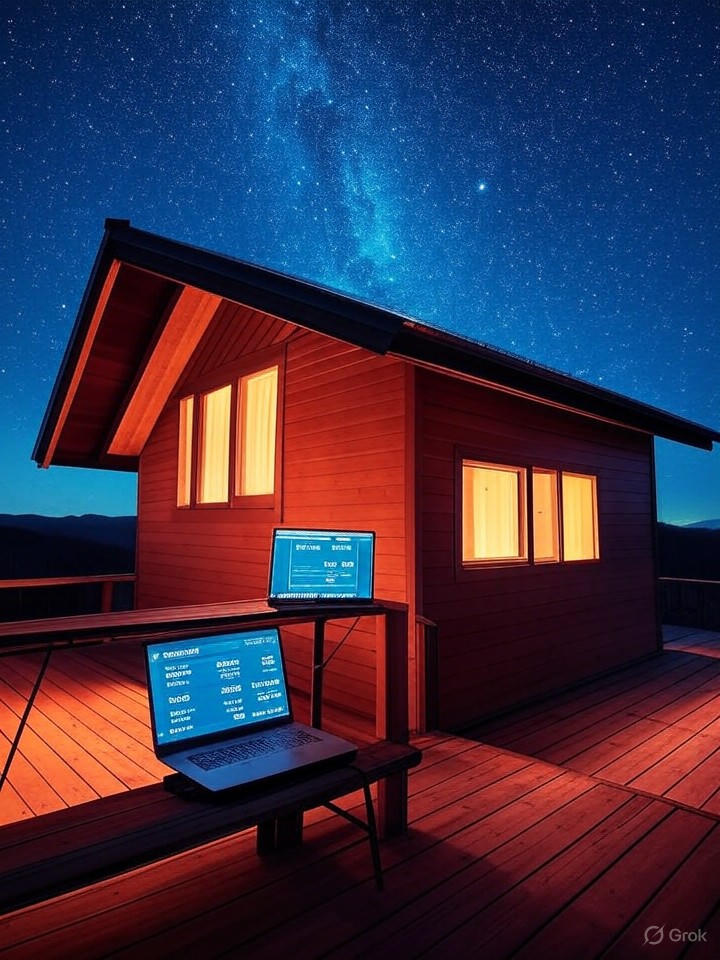

# Landing Page Funnel - Offgrid Farmstays

## Overview

This document outlines a complete landing page funnel system designed to convert cold traffic (ads, social media, search) into qualified consultation requests. Each landing page is hyper-focused on a specific traffic source or intent.

---

# LANDING PAGE 1: Bitcoin Community Traffic

## URL: `/bitcoin-land-income`

### Use Case
Traffic from: Twitter/X, Nostr, Bitcoin podcasts, Bitcoin Magazine ads
Audience: Bitcoin enthusiasts who own land or are considering rural property investment

---

## Hero Section

### Headline
**Stack Sats From Sunshine: Turn Your Land Into a Bitcoin Mining Retreat**

### Subheadline
Own land? Your property could generate 0.02+ BTC per month ($1,200-$2,000) through solar-powered mining + guest bookings—while orange-pilling travelers who stay there.

### Visual

*Off-grid cabin under starry night sky with solar panels and bitcoin mining integration*

### CTA
[Button] Calculate Your Property's BTC Earnings →

---

## Section 1: The Bitcoin Landowner Opportunity

### Headline
**Most Landowners are Sitting on Underutilized Bitcoin Mining Opportunity**

You already have:
✅ **Land** (cheaper than urban real estate)
✅ **Space** (for solar arrays)
✅ **Low time commitment** (automated systems)

You're missing:
❌ Solar production infrastructure
❌ Bitcoin mining integration
❌ Guest hospitality monetization

**We build the missing pieces. You collect BTC monthly.**

---

## Section 2: How It Works (Bitcoin-First Framing)

**Step 1: Solar Overproduction**
15-30 kW solar array generates 50-100 kWh/day. Your retreat uses 30%. Mining uses 60%. Batteries store 10%.

**Step 2: Immersion-Cooled Mining**
4-8 ASICs submerged in dielectric fluid. Silent, efficient, 95% heat recovery. No neighbors complaining about noise.

**Step 3: Heat Reuse**
Mining heat provides free hot water and space heating. Guests experience luxury; you experience zero heating bills.

**Step 4: AirBTC Bookings**
Bitcoin-native travelers book your retreat, pay in BTC, leave glowing reviews. Your mining operation becomes a destination.

**Result**: ~0.018 BTC/month from mining + ~$2,800/month from guests = **Total value >$4,000/month**

---

## Section 3: Real Bitcoin Earnings (Transparency)

### Headline
**What You'll Actually Earn (Conservative Numbers)**

**4-Miner Setup** (Standard)
- Hash Rate: 560 TH/s
- Power Draw: 14 kW (solar powered = $0 cost)
- Monthly BTC Production: ~0.018 BTC
- **At $65K BTC**: $1,170/month
- **At $85K BTC**: $1,530/month
- **At $100K BTC**: $1,800/month

**8-Miner Setup** (Advanced)
- Hash Rate: 1,120 TH/s
- Monthly BTC Production: ~0.036 BTC
- **At $65K BTC**: $2,340/month

**Plus Guest Revenue**:
- Average nightly rate: $185
- Average occupancy: 65%
- Monthly bookings: $2,800
- **Combined: $4,000-$5,100/month**

---

## Section 4: Why This Beats Traditional Mining

| Factor | Our Model | Traditional Mining Farm |
|--------|-----------|----------------------|
| **Electricity Cost** | $0 (solar) | $0.05-$0.12/kWh (grid) |
| **Heat Waste** | Reused (hot water, heating) | Wasted (ventilation) |
| **Noise** | Silent (immersion) | Loud (air-cooled) |
| **Revenue Streams** | 2 (mining + guests) | 1 (mining only) |
| **Zoning** | Hospitality (easier) | Industrial (harder) |
| **Downside Protection** | Guest revenue backstop | 100% BTC price dependent |
| **Bitcoin Adoption** | Orange-pills guests | Isolated operation |

**Bottom line**: Distributed mining on productive real estate > industrial mining farms

---

## Section 5: Bitcoin Philosophy Alignment

### Headline
**Proof of Work = Proof of Property Value**

This isn't speculation. It's energy monetization secured by Bitcoin's timechain.

**What we're building**:
- ⚡ Parallel economy infrastructure (AirBTC lodging network)
- 🏔️ Geographic decentralization (rural mining nodes)
- 🌱 Renewable-only mining (cleanest BTC on Earth)
- 🧡 Bitcoin circular economy (earn BTC, spend BTC, stack BTC)

**Every retreat we build strengthens the network**—literally (hash rate) and philosophically (real-world Bitcoin utility).

---

## Section 6: Case Study (Bitcoin Angle)

### Montana Rancher Goes From Zero to .23 BTC in Year One

**Before**:
- 25 acres, zero bitcoin exposure
- "Thought it was internet magic money"

**After Offgrid Farmstays**:
- 18 kW solar + 4 immersion miners
- .019 BTC/month average
- .23 BTC accumulated in year one
- Hasn't sold any (HODL mindset)

**His words**:
*"I didn't understand bitcoin until I saw it stacking in my wallet every week from energy my land was producing. Now I'm a maxi. Planning unit #2 next year—more hash rate, more sats."*

---

## Section 7: For the Technically Curious

**Mining Pool**: Your choice (we recommend based on payout structure)
**Firmware**: Stock or custom (Braiins OS+ for advanced users)
**Wallet**: Non-custodial setup, we teach you
**Monitoring**: Real-time dashboard (hash rate, uptime, earnings)
**Immersion Fluid**: Engineered dielectric or mineral oil
**Heat Exchanger**: Flat plate, 95% thermal transfer efficiency
**Redundancy**: Automatic failover, minimal downtime

**We handle the technical complexity. You verify—don't trust.**

---

## Section 8: CTA

### Headline
**Ready to Turn Your Land Into a Bitcoin-Earning Asset?**

Step 1: Calculate your property's BTC production potential
Step 2: Schedule free assessment (we evaluate your solar exposure)
Step 3: Get custom proposal (design, budget, timeline, hash rate)

[Button] Calculate BTC Earnings Now →

**Or talk to a bitcoiner who's built these**:
📞 (555) 123-4567
📧 bitcoin@offgridfarmstays.com

---

## Trust Elements (Bottom of Page)

✅ 50+ Projects, 45+ BTC Earned for Clients
✅ 100% Renewable Energy Mining
✅ Exergy Immersion Cooling Partner
✅ AirBTC Official Integration Partner

---

## Page Metadata

**Title**: Stack Sats From Your Land - Bitcoin Mining Retreat Builder
**Meta Description**: Build a solar-powered bitcoin mining retreat. Earn 0.02+ BTC/month + guest revenue. Free assessment for landowners.
**Keywords**: bitcoin mining land, solar bitcoin mining, earn bitcoin from property, bitcoin retreat

---

# LANDING PAGE 2: Passive Income Seekers

## URL: `/passive-income-farmland`

### Use Case
Traffic from: Google search ("passive income from land"), Facebook ads targeting rural landowners, real estate investor forums

---

## Hero Section

### Headline
**Turn Idle Farmland Into $4,000+/Month Passive Income**

### Subheadline
Build a solar-powered retreat that earns money 24/7 through guest bookings + energy monetization. We handle everything: design, permits, construction, booking setup.

### Visual
[Before/After split: Empty field → Beautiful cabin with guests, solar panels, revenue dashboard showing $4,235/month]

### CTA
[Button] See What Your Land Could Earn →

---

## Section 1: The Problem You're Solving

### You Own Land. It Costs You Money.

❌ **Property taxes**: $2,000-$8,000/year
❌ **Maintenance**: Mowing, fence repair, utilities
❌ **Opportunity cost**: Capital tied up, not working
❌ **No income**: Beautiful property, zero revenue

**Meanwhile**:
- AirBNBs in your area book for $150-$300/night
- Your land sits idle with perfect solar exposure
- Farmers struggle with unpredictable crop income

**What if your land could pay for itself—and generate profit?**

---

## Section 2: The Solution (Simplified)

### We Build Income-Generating Retreats on Your Property

**What We Build**:
🏠 Off-grid mini-homes or glamping units (400-600 sq ft)
☀️ Solar energy systems (powers everything + generates extra income)
🔥 Efficient heating (geothermal + heat reuse = $0 utility bills)
🏞️ Guest-ready amenities (hot tub, fire pit, modern kitchen)

**What You Get**:
💰 **Guest Revenue**: $2,500-$4,500/month (AirBNB-style bookings)
⚡ **Energy Revenue**: $1,000-$1,800/month (excess solar monetization)
📈 **Property Value**: $100K-$200K increase in land value
🔓 **Personal Use**: Enjoy it yourself when not booked

**Timeline**: 6-8 months from signing to first guest
**Investment**: $65K-$150K (financing available)
**Payback**: 2-4 years typical

---

## Section 3: Two Income Streams

### Visual: Pie Chart or Side-by-Side

**Revenue Stream 1: Guest Bookings** (60-70% of income)
- Platform: AirBTC or Airbnb
- Nightly rate: $150-$275
- Occupancy: 60-75%
- **Monthly: $2,500-$4,500**

**Revenue Stream 2: Energy Monetization** (30-40% of income)
- Solar panels overproduce
- Excess powers specialized equipment
- Generates passive income 24/7
- **Monthly: $1,000-$1,800**

**Combined Monthly Income: $3,500-$6,300**
**Annual: $42,000-$75,600**

---

## Section 4: Real Example (Relatable Story)

### From $6,000/Year in Property Taxes to $4,200/Month in Income

**Meet Sarah - Montana Ranch Owner**

**Her situation**:
- Inherited 25 acres, beautiful but costly
- Property taxes: $6,000/year
- Considered selling but wanted to keep family land

**Her solution (with us)**:
- Built 450 sq ft luxury cabin ($ 87K investment)
- Solar powered + guest bookings via AirBTC
- Year 1 results: $50,400 revenue

**Her outcome**:
- Paid off investment in 2.1 years
- Now generates $42K/year net (after expenses)
- Property value increased $180K
- Uses cabin herself 4 weekends/year

[Photo: Sarah at her cabin]

**"My land went from a liability to my best investment. I only wish I'd done it 10 years ago."**

[Button] Read Full Case Study →

---

## Section 5: Why Not Just Build a Regular Cabin?

### Comparison Table

| Traditional Rental Cabin | Our Bitcoin-Powered Retreat |
|-------------------------|----------------------------|
| High utility bills ($200-400/mo) | $0 utility bills (solar) |
| Single income (rent only) | Dual income (rent + energy) |
| You handle permitting | We handle permitting |
| You hire contractors | We manage construction |
| You figure out booking | We set up AirBTC for you |
| 4-6 year payback typical | 2-4 year payback typical |

**Why our model wins**: More revenue, lower costs, turnkey execution

---

## Section 6: What Makes This Passive?

### You Don't Have To:

❌ Be an expert in solar, construction, or bitcoin
❌ Navigate permitting bureaucracy (we handle)
❌ Manage contractors (we do that)
❌ Figure out booking platforms (we set up)
❌ Live on-site (hire local cleaner/manager)

### You Do Have To:

✅ Own suitable land (5+ acres, decent solar exposure)
✅ Invest $65K-$150K (or secure financing)
✅ Wait 6-8 months (construction timeline)
✅ Handle guest communication (or hire manager)
✅ Make decisions on design and approvals

**Bottom line**: More passive than farming, rentals, or most real estate ventures

---

## Section 7: Calculator (Lead Magnet)

### See What YOUR Land Could Generate

**Interactive Calculator**:
- Input: State, acres, budget
- Output: Estimated monthly revenue, payback period, 5-year ROI

[Button] Calculate My Income Potential →

(Requires email to get detailed PDF report)

---

## Section 8: Objections Handled

**"I don't have $100K sitting around"**
→ We work with HELOC, construction loans, and partner financing. Many clients use equity from primary home.

**"I don't know anything about solar or bitcoin"**
→ Perfect. We explain everything simply and handle all technical complexity. 30+ of our 50 clients started with zero knowledge.

**"What if it doesn't rent well?"**
→ We only build in markets with proven demand. Average occupancy across our projects: 68%. We show you comps before you commit.

**"Permitting sounds like a nightmare"**
→ It can be—if you do it alone. We've secured approvals in 30+ jurisdictions with 100% success rate. It's our expertise.

**"I'm not ready right now"**
→ No pressure. Get the free assessment, keep the feasibility report, reach out when timing is right.

---

## Section 9: CTA

### Headline
**Find Out If Your Land Qualifies**

**Free Assessment Includes**:
✓ Property solar potential analysis
✓ Revenue projections for your location
✓ Budget estimate for your land
✓ Permitting timeline for your county
✓ Honest go/no-go recommendation

[Button] Get Free Land Assessment →

**Trusted by 50+ Landowners**
⭐⭐⭐⭐⭐ 4.9/5 average rating

---

## Page Metadata

**Title**: Turn Farmland Into $4,000/Month Passive Income | Off-Grid Retreats
**Meta Description**: Build solar-powered retreats on your land. Earn $3,500-$6,300/month through guest bookings + energy. Free assessment for landowners.
**Keywords**: passive income farmland, make money from land, rental cabin income, solar property income

---

# LANDING PAGE 3: Solar/Renewable Energy Audience

## URL: `/solar-retreat-builder`

### Use Case
Traffic from: Solar installer ads, renewable energy forums, sustainability communities, green living blogs

---

## Hero Section

### Headline
**Make Your Solar Investment Pay for Itself—In 2 Years**

### Subheadline
Build an off-grid retreat with solar energy that earns revenue through guest bookings + intelligent energy monetization. No grid, no utility bills, pure profit.

### Visual
[Solar panels on beautiful cabin, energy dashboard showing "Grid Free Since 2023" and "$4,100/mo revenue"]

---

## Section 1: The Solar Opportunity Most Installers Miss

### Your Solar Array Can Do More Than Offset Your Electric Bill

**Traditional solar thinking**:
- Install panels → reduce utility bill → save $100-200/month → 8-12 year payback

**Our model**:
- Install panels → power retreat + monetize excess → earn $4,000/month → **2-3 year payback**

**The difference?** We design for overproduction and revenue generation, not just consumption offset.

---

## Section 2: How We Engineer Solar for ROI

### Solar System Design (15 kW example)

**Daily Production**: 60-80 kWh (location dependent)

**Allocation**:
1. **Retreat Consumption** (30%): Lights, appliances, HVAC, hot water = 20 kWh
2. **Revenue Generation** (60%): Specialized equipment earns $1,200-$1,800/month = 40 kWh
3. **Battery Storage** (10%): 1-2 days backup for cloudy weather = 8 kWh

**Guest Experience**:
100% solar powered, zero emissions, ultimate eco-credentials = Higher nightly rates ($50-100 premium for "fully solar")

---

## Section 3: Geothermal + Solar Synergy

### Why We Pair Solar with Geothermal

**The Problem**: Solar is intermittent, HVAC is the biggest load
**The Solution**: Geothermal heat pumps (400% efficient) + solar = Perfect match

**Benefits**:
- Geothermal reduces peak electrical demand 75%
- Solar powers geothermal during the day (free heating/cooling)
- Combined system = true energy independence

**Real data (Montana project)**:
- Without geothermal: Would need 25 kW solar + 40 kWh batteries ($$$)
- With geothermal: 18 kW solar + 15 kWh batteries (saves $18K)

---

## Section 4: Heat Reuse Innovation

### Don't Waste Heat—Monetize It

**The insight**: Revenue-generating equipment produces waste heat (usually vented)

**Our approach**: Capture heat with immersion cooling, reuse for:
- Domestic hot water (60-100% of needs)
- Radiant floor heating (supplement geothermal)
- Hot tubs / spas (guest amenity)
- Greenhouse climate control

**Result**: Your equipment earns money AND provides $200-400/month in heating value

**Efficiency**: 95% heat recovery (vs. 0% in traditional setups)

---

## Section 5: True Off-Grid Case Study

### New Mexico Desert Compound: 100% Solar, Zero Grid

**Challenge**: 40 acres, 45 min from Santa Fe, no utility access within 3 miles

**Solution**:
- 25 kW solar array
- 80 kWh battery bank (3-day autonomy)
- Geothermal heating/cooling
- Rainwater catchment (10,000 gallon cistern)
- Revenue equipment for income generation

**Performance (Year 1)**:
- 365 days grid-free
- Zero utility bills
- $54,000 revenue (guest bookings + energy monetization)
- Environmental: 35,000 kWh clean energy, 38,000 lbs CO2 avoided

**Guest appeal**: "Stay completely off-grid" = 4.9-star rating, $275/night rates

---

## Section 6: Solar Component Specs (For The Technical)

**Panels**:
- Monocrystalline (20-22% efficiency)
- 370-425W per panel
- Tier 1 manufacturers (LG, REC, Canadian Solar)
- 25-year performance warranty

**Inverters**:
- Enphase microinverters (residential scale) OR
- SMA/Fronius string inverters (larger arrays)
- 97-99% efficiency
- Rapid shutdown compliant

**Batteries** (if specified):
- LiFePO4 chemistry (safest)
- 10-15 year lifespan
- 5,000+ cycle rating
- AC-coupled systems for flexibility

**Monitoring**:
- Real-time production/consumption
- Panel-level diagnostics
- Weather-adjusted forecasting
- Mobile app + web portal

---

## Section 7: Environmental Impact

### By the Numbers (Typical 18 kW System)

**Annual Clean Energy**: 28,000 kWh

**Carbon Offset**:
- Equivalent to 31,000 lbs CO2 avoided
- Same as planting 360 trees
- Removing 3 cars from the road

**Fossil Fuel Displacement**:
- Propane heating eliminated: 800 gallons/year
- Grid electricity avoided: 10,000 kWh/year (usually fossil-generated)

**When paired with revenue generation**: Carbon-negative operation (displacing grid mining + fossil heating)

---

## Section 8: CTA

### Headline
**Design Your Solar-Powered Retreat**

We're renewable energy engineers who love ambitious projects. If you want solar that pays for itself in 2-3 years (not 8-10), let's talk.

**Free Solar Assessment**:
✓ Site-specific production modeling (your GPS coordinates)
✓ System sizing for retreat + revenue generation
✓ ROI analysis (payback, NPV, IRR)
✓ Heat reuse design (maximize efficiency)

[Button] Get Free Solar Assessment →

**Or call our energy engineers**:
📞 (555) 123-4567
📧 solar@offgridfarmstays.com

---

## Page Metadata

**Title**: Solar-Powered Retreat Builder | Off-Grid Construction + Revenue
**Meta Description**: Engineer solar systems that pay for themselves in 2-3 years through guest income + energy monetization. Free assessment for landowners.
**Keywords**: solar retreat builder, off-grid solar cabin, solar passive income, renewable energy property

---

# LANDING PAGE 4: ROI Calculator Tool Page

## URL: `/retreat-roi-calculator`

### Use Case
Standalone tool for lead capture, linked from ads, social media, blog posts
Purpose: Get email in exchange for detailed PDF report

---

## Hero Section

### Headline
**Calculate Your Property's Income Potential in 60 Seconds**

### Subheadline
See what your land could generate through solar-powered retreats—guest revenue + energy earnings, personalized for your location and budget.

---

## Calculator Interface (Large, Clean)

**Your Property**
- State/Region [Dropdown]
- Land Size [Slider: 5-100+ acres]
- Solar Exposure [Dropdown: Excellent / Good / Moderate / Shaded]

**Your Project**
- Retreat Type [Dropdown: Mini-Home / Glamping / Multi-Unit]
- Square Footage [Slider: 200-800]
- Budget [Slider: $40K-$200K]

**Market Assumptions**
- Nightly Rate [Auto-filled by region, editable]
- Occupancy % [Slider: 40-80%, default 65%]

---

## Live Results Panel

**Estimated Investment**: $87,000

**Monthly Revenue**:
- Guest Bookings: $2,800
- Energy Earnings: $1,400
- **Total: $4,200/month**

**Annual Revenue**: $50,400

**Operating Costs**: $8,500/year

**Net Cash Flow**: $41,900/year

**ROI Metrics**:
- Payback Period: 2.1 years
- 5-Year Return: 241%
- Property Value Increase: ~$175,000

[Chart: Investment vs. Revenue over 7 years]

---

## Email Gate

### Get Your Detailed PDF Report

Your custom report includes:
✓ Itemized cost breakdown
✓ Revenue projections (conservative, moderate, optimistic)
✓ Comparable properties in your region
✓ Solar production estimates for your GPS coordinates
✓ Permitting timeline for your county
✓ Next steps to make it real

**Email** [Input]
**Name** (optional) [Input]

[Button] Send Me the Report

---

## Post-Submit Thank You Page

**Thank You! Check Your Email.**

Your custom ROI report is on its way. While you wait:

[Button] Schedule Free Assessment →
[Button] Read Case Studies →
[Button] See What We Build →

**Questions?** Call (555) 123-4567

---

## Email Automation Sequence (Triggered)

**Email 1** (Immediate): PDF report delivery + welcome
**Email 2** (Day 2): Case study similar to their inputs
**Email 3** (Day 5): "How the process works" educational
**Email 4** (Day 9): Invitation to schedule consultation
**Email 5** (Day 14): Last touch - "Still interested?" + limited availability

---

## Page Metadata

**Title**: Retreat ROI Calculator - Estimate Your Passive Income Potential
**Meta Description**: Free calculator: See what your land could earn through solar-powered retreats. Get custom PDF report with revenue projections and costs.
**Keywords**: retreat ROI calculator, passive income calculator land, airbnb income estimator, solar retreat revenue

---

# LANDING PAGE 5: Geographic-Specific (Template)

## URL Pattern: `/montana-retreat-builder`, `/texas-off-grid-builder`, etc.

### Use Case
Local SEO, state-specific ad campaigns, regional targeting

---

## Hero Section (Montana Example)

### Headline
**Montana's Leading Bitcoin-Powered Retreat Builder**

### Subheadline
We've built 12 solar-powered retreats across Montana—from Missoula to Bozeman to Glacier Country. We know your permitting, your climate, your market.

### Visual
[Montana landscape with completed cabin, Montana flag or state outline]

---

## Section 1: Why Montana is Perfect for This

✅ **Abundant Solar**: 5.0-5.5 sun hours/day (better than most realize)
✅ **Tourism Market**: 12M+ visitors/year seek unique lodging
✅ **Landowner-Friendly**: Rural counties generally accommodating for ADUs
✅ **Bitcoin Culture**: Growing bitcoin mining industry (we're part of it)
✅ **Property Values**: Land prices rising—retreats add $150K-$250K value

---

## Section 2: Montana-Specific Services

**We Navigate Montana Regulations**:
- DEQ (septic, water quality)
- County planning departments (we know your planners)
- Montana Electrical Code specifics
- Snow load requirements (60-100 PSF in mountain counties)
- Firewise construction standards

**We Design for Montana Climate**:
- R-50+ roof insulation (handle -30°F winters)
- Geothermal sized for heating-dominant loads
- Snow shedding roof angles
- Four-season guest appeal (summer hikes, winter skiing)

---

## Section 3: Montana Project Showcase

### 3 Featured Montana Projects

**Project 1: Flathead Valley Luxury Cabin**
- Location: 15 min from Glacier National Park
- Investment: $105,000
- Revenue: $6,200/month (summer peak)
- Nightly rate: $285 (park proximity premium)

**Project 2: Bozeman Ranch Retreat**
- Location: 25 acres, mountain views
- Investment: $87,000
- Revenue: $4,200/month
- (This is the flagship Montana case study)

**Project 3: Missoula Glamping Duo**
- Location: Lolo National Forest border
- Investment: $68,000 (2 units)
- Revenue: $3,800/month

---

## Section 4: Montana Market Data

**Average Nightly Rates** (Off-grid cabins):
- Near National Parks: $225-$350
- Mountain views: $175-$275
- Standard rural: $150-$225

**Occupancy Rates**:
- Peak (Jun-Sep): 80-95%
- Shoulder (May, Oct): 60-75%
- Winter (Nov-Apr): 35-50% (ski areas higher)
- **Annual average: 65-70%**

**Guest Demographics**:
- 60% out-of-state (California, Texas, Washington)
- 40% in-state (Billings, Great Falls weekend escapes)
- Age: 30-55 primary
- Interests: Hiking, fly fishing, stargazing, skiing

---

## Section 5: Montana Permitting Timeline

**Typical Timeline by County**:
- **Flathead**: 10-14 weeks (efficient department)
- **Gallatin** (Bozeman): 12-16 weeks (busy, but professional)
- **Missoula**: 10-12 weeks (accommodating for rural)
- **Park** (Livingston): 8-12 weeks (smaller staff, faster)
- **Lewis & Clark** (Helena): 12-16 weeks (thorough reviews)

**We've secured permits in**: Flathead, Gallatin, Missoula, Park, Lewis & Clark, Madison, Ravalli counties

---

## Section 6: Montana-Specific FAQ

**Q: Can I build this on agricultural zoned land?**
A: Usually yes, with a conditional use permit for "agritourism" or "farm stay." We've done this 8 times in Montana.

**Q: What about well and septic in Montana?**
A: We coordinate with licensed well drillers and design septic for DEQ approval. Typical costs: $8K-$15K (well), $6K-$12K (septic).

**Q: Does Montana's climate support solar?**
A: Yes! Montana averages 5.0-5.5 peak sun hours/day (similar to Florida). Cold temps actually increase panel efficiency.

**Q: What about winter guests?**
A: Ski areas (Big Sky, Whitefish) see strong winter occupancy. Other areas softer but still bookable. We design 4-season retreats.

---

## Section 7: Local Partnerships

**Montana Contractors We Work With**:
- [Local Excavation Company]
- [Regional Well Drilling]
- [Montana Electricians Association Member]
- [Timber Frame Builder - Montana]

**Montana-Specific Suppliers**:
- Reclaimed Montana timber (local character)
- Montana stone (fireplaces, accents)
- Locally-made furniture (guest appeal + support local)

---

## Section 8: CTA

### Headline
**Get Your Free Montana Land Assessment**

We'll visit your property, analyze solar potential, discuss county-specific permitting, and give you honest ROI projections based on Montana market comps.

[Button] Schedule Montana Assessment →

**Montana Office**:
📍 Bozeman, MT
📞 (555) 123-4567
📧 montana@offgridfarmstays.com

---

## Page Metadata

**Title**: Montana Bitcoin-Powered Retreat Builder | Off-Grid Cabins & Glamping
**Meta Description**: Montana's leading off-grid retreat builder. 12 projects across Flathead, Gallatin, Missoula. Solar + bitcoin + guest income. Free assessment.
**Keywords**: Montana cabin builder, Montana off-grid, Montana glamping construction, Montana retreat builder, Montana solar cabin

---

# Funnel Performance Tracking

## Key Metrics to Track Per Landing Page

**Traffic**:
- Total visitors
- Traffic source (paid, organic, social, referral)
- Bounce rate
- Time on page

**Engagement**:
- Calculator completions (LP 4)
- Scroll depth
- Video plays (if embedded)

**Conversions**:
- Email captures (calculator downloads)
- Consultation form submissions
- Phone calls (track with unique numbers per LP)
- Live chat initiations

**Quality**:
- Consultation show-up rate
- Proposal conversion rate (leads → contracts)
- Cost per qualified lead
- Customer acquisition cost

---

## A/B Testing Roadmap

**Test 1**: Headlines
- Bitcoin-focused vs. Income-focused vs. Sustainability-focused

**Test 2**: CTA Button Text
- "Get Free Assessment" vs. "Calculate My Income" vs. "See What I Could Earn"

**Test 3**: Form Length
- Minimal (email only) vs. Detailed (property info upfront)

**Test 4**: Social Proof Placement
- Above fold vs. Mid-page vs. Bottom

**Test 5**: Calculator Interactivity
- Require email before using vs. Free use, email for PDF

---

## Budget Allocation Recommendation

**Paid Traffic to Landing Pages**:
- Google Search Ads: 40% ($800/month starting budget)
  - Target: "passive income farmland", "off-grid cabin builder [state]"
- Facebook/Instagram Ads: 30% ($600/month)
  - Audience: Rural landowners 40-65, interests in real estate investing
- Twitter/Bitcoin Communities: 20% ($400/month)
  - Promoted tweets to bitcoin hashtags
- Retargeting: 10% ($200/month)
  - Remarket calculator users who didn't convert

**Total Month 1**: $2,000/month
**Goal**: 100-150 landing page conversions (emails/calls)
**Target Cost Per Lead**: $13-20

---

## Implementation Priority

**Phase 1** (Launch first):
1. Landing Page 4: ROI Calculator (highest conversion tool)
2. Landing Page 2: Passive Income (broadest appeal)

**Phase 2** (Month 2):
3. Landing Page 1: Bitcoin Community (niche but high-intent)
4. Landing Page 5: Geographic (pick top 2 states)

**Phase 3** (Month 3+):
5. Landing Page 3: Solar/Renewable (sustainability audience)
6. Additional geographic pages (scale based on performance)

---

**All landing pages should be**:
- Mobile-optimized (60%+ traffic will be mobile)
- Fast-loading (<2 seconds)
- Clear single CTA (minimize distractions)
- Trust signals prominent (testimonials, project count, ratings)
- Exit-intent popup (offer guide download if abandoning)
