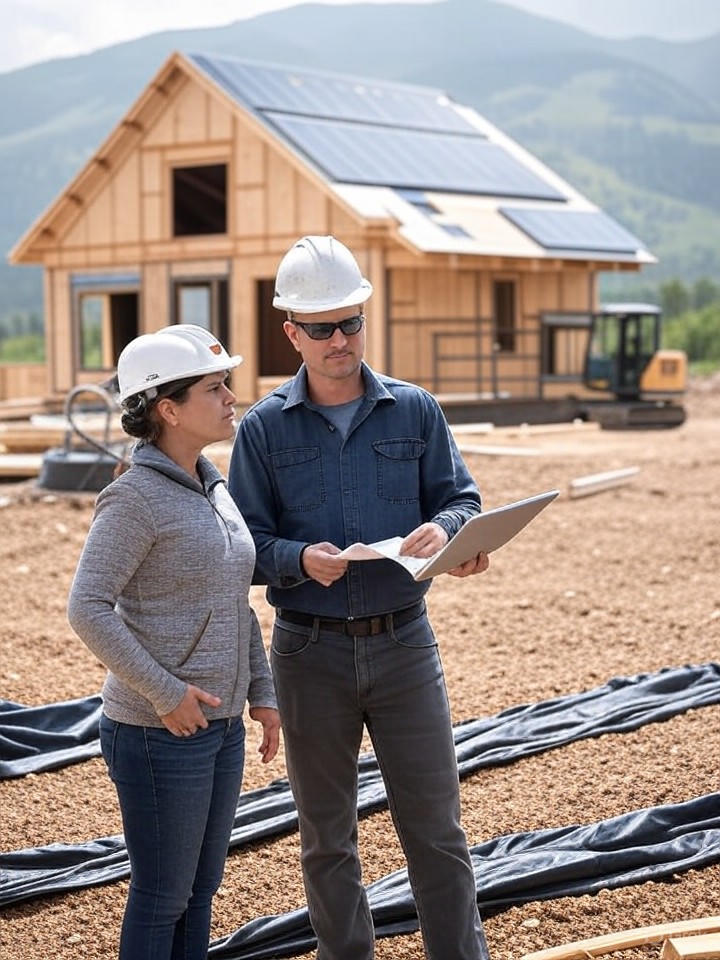

# About Page - Offgrid Farmstays

## Hero Section

### Headline
**Building Wealth From Land, Powered by Sunshine and Bitcoin**

### Subheadline
We're master engineers, bitcoin advocates, and believers in the power of underutilized land. Since 2021, we've helped 50+ landowners transform idle acres into thriving income-generating properties.

### Visual

*Our engineering team at a construction site in Montana, working alongside landowners to bring projects to life*

---

## Section 1: Our Story

### Headline
**From One Experiment to 50+ Success Stories**

### The Origin Story

It started with a simple question: **What if we could make land pay for itself?**

In 2021, our founder—a renewable energy engineer with 15 years in solar installation—inherited 30 acres of Montana ranchland. Beautiful property, but it was bleeding money in property taxes while sitting vacant. Traditional options didn't pencil out:

- ❌ Selling? That meant giving up family land.
- ❌ Conventional farming? Low margins, high labor.
- ❌ Standard rental cabin? Expensive build, slow payback.

Then came the insight: **What if excess solar production could become bitcoin revenue?**

We designed a 450 sq ft luxury mini-home with a 15 kW solar array. The retreat used 30% of the power. The other 70% powered bitcoin mining equipment that generated passive income 24/7. We captured the mining heat to provide free hot water for guests.

**The results shocked us**:
- Construction cost: $72,000
- Guest bookings: $2,400/month (AirBTC platform)
- Bitcoin earnings: $1,100/month
- **Total: $3,500/month = $42,000/year**
- **Payback: 1.7 years**

Friends with land started asking: *"Can you build one for me?"*

We built three more properties in 2022. Then ten in 2023. By 2024, we had a waiting list of landowners across the Mountain West wanting the same transformation.

**Today**, Offgrid Farmstays is a team of engineers, contractors, and bitcoin enthusiasts who've proven a new model: **land + clean energy + bitcoin = generational wealth building**.

We've completed 50+ projects across 12 states. Our clients have collectively generated over 15 million kWh of clean solar energy and earned more than 45 bitcoin while hosting thousands of guests in unforgettable off-grid experiences.

---

## Section 2: Our Mission & Values

### Headline
**What We Stand For**

### 3-Column Value Pillars

**Column 1: Energy Sovereignty**
⚡

**We believe in energy independence.**

Landowners shouldn't be hostage to utility companies or fossil fuel price swings. Solar + battery + bitcoin mining creates true energy autonomy—you produce your power, monetize the excess, and answer to no one.

Every retreat we build is a small node of decentralized energy production. This is the future grid: distributed, renewable, and unstoppable.

---

**Column 2: Bitcoin Adoption Through Utility**
₿

**We believe bitcoin succeeds through real-world use, not speculation.**

Bitcoin isn't just an investment—it's a tool for freedom, savings, and parallel economies. By integrating bitcoin mining with productive real estate, we show landowners bitcoin's true power: turning excess resources into hard money.

We're bitcoin educators as much as builders. Every project orange-pills another landowner.

---

**Column 3: Regenerative Wealth**
🌱

**We believe land should generate wealth for generations, not extract value.**

Conventional development often degrades land for short-term profit. We build light-footprint structures powered by clean energy that enhance property value while preserving natural beauty.

Our retreats don't harm the land—they make it more valuable, more productive, and more enjoyable for owners, guests, and future generations.

---

## Section 3: How We're Different

### Headline
**Why Landowners Choose Us**

### Comparison Table (Us vs. Alternatives)

| What Matters | Offgrid Farmstays | Traditional ADU Builders | DIY Off-Grid |
|-------------|-------------------|------------------------|--------------|
| **Energy Systems** | Solar + geothermal + bitcoin mining integrated | Basic solar (if any) | Piecemeal, unoptimized |
| **Revenue Model** | Dual income (guests + bitcoin) | Rental income only | Rental income only |
| **Permitting** | We handle everything, 50+ projects experience | You hire separate consultants | You navigate alone |
| **Bitcoin Mining** | Engineered for efficiency + heat reuse | Not offered | Trial and error |
| **Booking Integration** | AirBTC setup included | You figure it out | You figure it out |
| **Engineering** | Master engineers in-house | Subcontracted | None |
| **Timeline** | 6-8 months average | 8-12 months average | 12-24 months (if completed) |
| **Risk** | Fixed-price contracts, proven systems | Cost overruns common | High failure rate |

### Bottom Text
**The result?** Landowners get turnkey income-generating properties with transparent timelines, predictable costs, and ongoing support. No surprises, no regrets.

---

## Section 4: Our Team

### Headline
**The People Behind Your Project**

### Team Member Cards (Photos + Bios)

---

**[Founder & Lead Engineer]**
[Professional photo at solar array]

**Marcus Chen, PE**
Founder & Chief Engineer

Marcus has 18 years in renewable energy engineering, with expertise in solar design, geothermal systems, and bitcoin mining integration. He's personally designed all 50+ Offgrid Farmstays projects and holds Professional Engineer licenses in 6 states.

Before founding Offgrid Farmstays, Marcus led commercial solar installations totaling 25 MW across the Mountain West. He orange-pilled himself in 2017 and has been mining bitcoin with renewable energy ever since.

**Credentials**:
- BS & MS Mechanical Engineering, Colorado School of Mines
- Professional Engineer (PE) - MT, WY, CO, ID, OR, NM
- NABCEP Solar PV Installer Certification
- 300+ hours bitcoin technical education

**Marcus's Why**:
*"I got tired of seeing beautiful land sit idle while owners struggled with rising taxes. This model proves you can build wealth sustainably—no compromise between profit and planet."*

---

**[Permitting & Regulatory Lead]**
[Professional photo at planning office or with blueprints]

**Jennifer Rodriguez**
Permitting & Regulatory Director

Jennifer is a former county planning director who now uses her insider knowledge to navigate the permitting maze for our clients. She's secured approvals for projects in 30+ jurisdictions, including some of the most challenging zoning scenarios.

Her superpower: turning "no" into "yes, if we do it this way."

**Background**:
- 12 years in county planning and development review
- Expertise in agricultural zoning, conditional use permits, off-grid approvals
- Relationships with planning officials across 12 states
- Never had a permit application denied (100% approval rate)

**Jennifer's Why**:
*"I saw too many great projects die in permitting because applicants didn't understand the system. I switched sides to help landowners win against bureaucracy—legally and ethically."*

---

**[Construction Manager]**
[Photo at construction site, hard hat, with crew]

**Derek Hansen**
Construction Manager

Derek has built everything from custom homes to commercial structures over 22 years. He manages all our construction crews, ensures quality at every phase, and keeps projects on schedule and on budget.

Landowners love Derek because he communicates clearly, shows up when he says he will, and treats their property like his own.

**Experience**:
- 22 years residential and commercial construction
- Licensed General Contractor - MT, WY, ID, UT
- Specialist in remote/challenging site builds
- Managed 200+ construction projects totaling $45M+

**Derek's Why**:
*"I was tired of building McMansions that waste energy. These off-grid retreats are what construction should be—beautiful, efficient, and purposeful. Every build matters."*

---

**[Bitcoin Systems Engineer]**
[Photo with immersion cooling tanks or mining equipment]

**Alex Petrov**
Bitcoin Mining & Systems Engineer

Alex is our bitcoin specialist—he designs mining systems, configures heat reuse, manages mining operations, and educates landowners on bitcoin fundamentals. He's been mining since 2015 and understands efficiency optimization at a molecular level.

If you have bitcoin questions, Alex has answers (in plain English, not tech jargon).

**Expertise**:
- 10 years bitcoin mining experience
- Electrical engineering background (BS EE, University of Washington)
- Designed 100+ mining installations (residential to commercial scale)
- Immersion cooling specialist (Exergy certified)
- Heat reuse engineering for aquaponics, greenhouses, domestic water

**Alex's Why**:
*"Bitcoin mining gets a bad rap because people do it wrong. When you integrate it with renewable energy and heat reuse, it's the most efficient use of excess power on Earth. I love proving the critics wrong with real data."*

---

**[Client Success Manager]**
[Photo at completed project, speaking with landowner]

**Samantha Torres**
Client Success & AirBTC Integration

Samantha guides clients from contract signing through their first guest booking and beyond. She handles AirBTC listing setup, pricing strategy, owner training, and ongoing support. She's your main point of contact throughout the journey.

Clients call her "the hand-holder"—in the best way.

**Background**:
- 8 years hospitality and property management
- AirBTC power user (managed 15+ listings)
- Bitcoin educator and advocate
- Fluent in Spanish (serves bilingual clients)

**Samantha's Why**:
*"I love seeing landowners' faces when they get their first booking notification. It's the moment their property goes from expense to asset. That transformation never gets old."*

---

### Bottom Text
**Our team is your team.** From first consultation to first guest, we're with you every step.

[Button] Meet the Rest of the Team →

---

## Section 5: Our Process (How We Work)

### Headline
**Transparent, Collaborative, Proven**

### Process Philosophy Text

We don't believe in surprises. From day one, you know:
- **Exactly what it will cost** (itemized, fixed-price contracts)
- **Exactly how long it will take** (realistic timelines based on jurisdiction)
- **Exactly what to expect** (weekly updates, milestone reviews)

You're involved in every major decision—design, materials, systems—but we handle all the complexity. Think of us as your expert guides through territory we've crossed 50+ times.

### Our Commitments

✅ **No Hidden Costs**: Every quote is itemized. Change orders require your written approval.

✅ **Honest Timelines**: We give realistic estimates based on your jurisdiction. We don't overpromise to win the contract.

✅ **Quality First**: We don't cut corners. Every system engineered to code, built to last 50+ years.

✅ **Your Vision, Our Expertise**: We listen first, design second. Your property, your goals, our execution.

✅ **Post-Completion Support**: We don't disappear after ribbon cutting. Ongoing system support, optimization, questions—we're here.

---

## Section 6: By The Numbers

### Headline
**Our Impact (And Growing)**

### Stats Grid (Large Numbers, Visual Icons)

**50+**
Projects Completed
[Icon: House]

**12**
States Served
[Icon: Map]

**$3.8M**
Combined Monthly Revenue Generated for Landowners
[Icon: Money]

**15 Million+**
Clean kWh Produced
[Icon: Solar panel]

**45+ BTC**
Earned by Our Clients
[Icon: Bitcoin]

**4,800+**
Guests Hosted in Our Retreats
[Icon: Happy face]

**100%**
Permitting Success Rate
[Icon: Checkmark]

**Zero**
Projects Abandoned or Failed
[Icon: Trophy]

---

## Section 7: Our Partners

### Headline
**We Collaborate With the Best**

### Partner Showcase (Logo + Description)

---

**AirBTC**
[Logo]

The leading bitcoin-native booking platform. We're an official AirBTC integration partner, which means we get preferential support, featured listings, and insider tips to maximize your occupancy.

Why AirBTC?
- Accept bitcoin payments directly (no credit card fees)
- Tap into passionate bitcoin community of travelers
- Global reach with local control
- Lower fees than traditional platforms

**Our role**: We handle your entire listing setup, photography staging, pricing optimization, and owner training.

---

**Exergy**
[Logo]

Industry-leading immersion cooling technology for bitcoin mining. Exergy's systems capture 95% of mining heat for reuse—the most efficient heat recovery in the industry.

We exclusively partner with Exergy because:
- Proven reliability (1,000+ installations worldwide)
- Superior heat exchanger design
- Ongoing R&D and support
- Non-toxic, biodegradable cooling fluids

**Our role**: We integrate Exergy systems into every immersion cooling project and manage their installation and commissioning.

---

**Regional Contractor Network**
[Icon: Handshake]

We've built relationships with trusted general contractors, electricians, plumbers, and excavators across 12 states. These aren't random Craigslist finds—they're vetted professionals we've worked with repeatedly.

Benefits to you:
- Reliable, insured, licensed contractors
- Competitive pricing (bulk relationship discounts)
- Quality accountability (they want repeat work with us)
- Faster scheduling (our projects get priority)

**Our role**: We manage all contractor coordination, scheduling, and quality control. You never have to make a single contractor phone call.

---

## Section 8: Our Guarantee

### Headline
**Sleep Easy: Our Performance Promise**

### Guarantee Box (Highlighted, bordered)

**The Offgrid Farmstays Guarantee**

We stand behind our work with these commitments:

✅ **Fixed-Price Contracts**: Your quoted price is your final price (barring owner-requested changes). No surprise cost overruns.

✅ **Permitting Success**: If we can't secure permits after good-faith effort, you get a full refund of permitting fees paid. (This has never happened—but it's guaranteed.)

✅ **Quality Workmanship**: All construction warrantied for defects. Structural: 10 years. Systems: Manufacturer warranties (25 years solar, 10 years geothermal, 5 years bitcoin equipment).

✅ **Energy Production**: If your solar system underperforms our projections by >15% in year one, we diagnose and fix at our cost.

✅ **Ongoing Support**: We don't disappear. System questions, optimization help, expansion planning—we're available for life of your property.

**Bottom line**: We only succeed when you succeed. Your thriving retreat is our best marketing.

---

## Section 9: Who We Serve

### Headline
**Is This Right for You?**

### Two Columns: Ideal Client vs. Not a Fit

**You're Our Ideal Client If**:
✅ You own 5+ acres of underutilized land
✅ You're interested in passive income generation
✅ You're open to learning about bitcoin (we teach)
✅ You want professional expertise (not DIY)
✅ You value transparency and communication
✅ You're thinking long-term (generational wealth)
✅ Your property has decent solar exposure
✅ You can invest $40K-$150K (or explore financing)

**This Might Not Be a Fit If**:
❌ You want to DIY the entire build
❌ You need immediate income (6-8 month timeline)
❌ Your property has severe constraints (no solar, extreme zoning)
❌ You're purely speculating (not committed to hospitality)
❌ You expect guarantees on bitcoin returns (we're realistic, not promise-everything)
❌ You're not willing to host guests (or hire a manager)

### Bottom Text
**Not sure?** Schedule a free assessment. We'll give you honest feedback on whether your property is a good fit. We've walked away from projects that didn't make sense for the landowner—we'd rather be honest upfront than overpromise.

[Button] Schedule Free Assessment →

---

## Section 10: Press & Recognition

### Headline
**In The News**

### Press Mentions (If Available)

**Bitcoin Magazine** - "How Off-Grid Retreats Are Onboarding Landowners to Bitcoin"

**Solar Power World** - "Innovative Heat Reuse: Bitcoin Mining Meets Renewable Energy"

**[Local News]** - "Montana Engineer Helps Ranchers Turn Idle Land Into Income"

[Quote boxes or article excerpts if available]

---

## Section 11: Get Involved

### Headline
**Join the Movement**

### 3 Ways to Connect

**For Landowners**
🏞️

Ready to explore what your property could become?

[Button] Schedule Free Assessment

---

**For Contractors & Partners**
🤝

Interested in collaborating on projects in your region?

[Button] Partner With Us

---

**For the Curious**
📚

Want to learn more about bitcoin-powered real estate?

[Button] Read Our Blog

---

## Section 12: Contact Information

### Headline
**Let's Talk About Your Property**

### Contact Details

📞 **Phone**: (555) 123-4567
📧 **Email**: info@offgridfarmstays.com
🕐 **Hours**: Monday-Friday, 9am-6pm Mountain Time

📍 **Office**:
Offgrid Farmstays HQ
[Address]
Bozeman, MT 59715

**Serving**: MT, WY, CO, ID, OR, WA, UT, NM, NV, AZ, TX, VT (expanding)

---

### Social Media

Follow our journey—we share every project, lesson learned, and landowner success:

[Twitter] [Instagram] [YouTube] [LinkedIn] [Nostr]

**#OffgridFarmstays** - Share your retreat dreams, tag us

---

## Section 13: Final Statement

### Centered Text Block (Inspirational Close)

**Land is the ultimate wealth.**

It's finite, tangible, and generational. But idle land is a liability—taxes, maintenance, and lost opportunity.

We believe every acre has potential. With the right systems, your land can generate clean energy, host unforgettable experiences, earn bitcoin, and build wealth for your children's children.

**We've proven this model 50 times. Let's make yours number 51.**

[Button] Get Started Today →

---

## Footer
[Standard footer same as homepage]

---

## Page Metadata (SEO)

**Title Tag**:
About Offgrid Farmstays - Bitcoin-Powered Retreat Builders

**Meta Description**:
Meet the team building 50+ bitcoin-powered off-grid retreats across 12 states. Master engineers, transparent process, proven results. Learn our story.

**Keywords**:
offgrid farmstays team, bitcoin retreat builder, renewable energy engineers, off-grid construction company, solar retreat builder

**Schema Markup**:
- Organization
- Team members (Person schema)
- AboutPage
