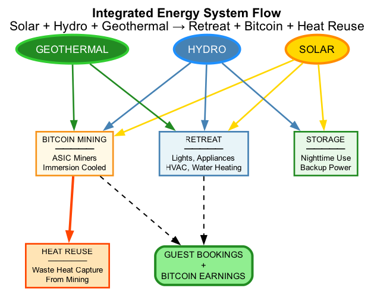
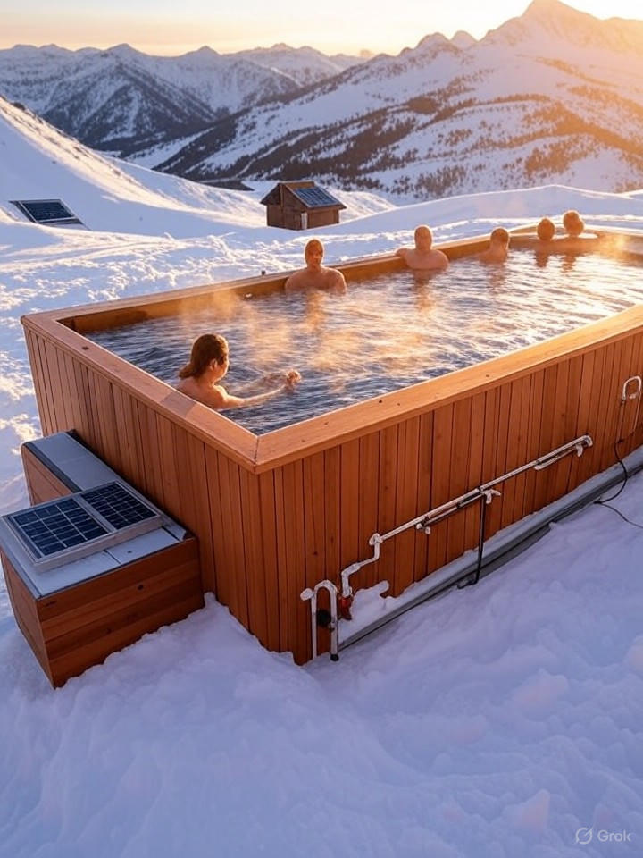

# Energy Systems Page - Offgrid Farmstays

## Hero Section

### Headline
**Clean Energy That Pays: Solar, Geothermal, and Bitcoin Innovation**

### Subheadline
Our master engineers integrate three proven technologies to power your retreat, eliminate utility costs, and generate bitcoin revenue—all while capturing waste heat for guest comfort.

### Visual

*Complete energy system showing solar production distribution: 30% retreat consumption, 60% bitcoin mining, 10% battery storage, with heat reuse for hot water and space heating*

---

## Section 1: The Integrated Energy System

### Headline
**Three Systems Working as One**

### Overview
Most builders install solar panels and call it a day. We engineer complete energy ecosystems where every kilowatt-hour has maximum value—powering your retreat, earning bitcoin, and providing heat through intelligent reuse.

### System Components (Visual Diagram)

**1. Solar Production** → Generates clean electricity
**2. Energy Distribution** → Powers retreat + bitcoin mining
**3. Heat Capture** → Immersion cooling captures 95% of mining heat
**4. Heat Reuse** → Free hot water, space heating, or agricultural applications
**5. Battery Storage** (Optional) → Energy independence during cloudy days

---

## Section 2: Solar Energy Systems

### Headline
**Solar: The Foundation of Your Energy Independence**

### How It Works

Photovoltaic panels convert sunlight directly into DC electricity. Inverters transform this into AC power that runs standard appliances. We size systems to overproduce—your retreat uses 30-40%, bitcoin mining uses 50-60%, and batteries store 10% for nighttime use.

### Our Solar Design Philosophy

✅ **Oversize Intentionally**: We don't just meet your retreat's needs—we produce excess for bitcoin earnings
✅ **Premium Components**: 25-year panel warranties, microinverters, commercial racking
✅ **Aesthetic Integration**: Roof-mounted or ground arrays designed to complement architecture
✅ **Future-Proof**: Wired for easy expansion if you add units later

---

### Typical Solar System Specifications

**Mini-Home (400-500 sq ft)**
- **Array Size**: 15-18 kW
- **Panel Count**: 40-48 panels (375W each)
- **Monthly Production**: 1,800-2,500 kWh (varies by location)
- **Retreat Consumption**: 500-700 kWh
- **Mining Allocation**: 1,000-1,500 kWh
- **Excess/Storage**: 300-500 kWh
- **Installation Cost**: $22,000-$32,000
- **Production Value**: $300-$450/month utility equivalent + $1,200-$1,800 bitcoin earnings

**Glamping Unit (200-350 sq ft)**
- **Array Size**: 10-12 kW
- **Monthly Production**: 1,200-1,600 kWh
- **Installation Cost**: $15,000-$22,000

**Multi-Unit (3-5 cabins)**
- **Array Size**: 30-50 kW
- **Monthly Production**: 3,500-6,500 kWh
- **Installation Cost**: $45,000-$75,000 (economies of scale)

---

### Components We Use

**Solar Panels**
- Brand: Tier 1 manufacturers (LG, REC, Canadian Solar)
- Efficiency: 20-22%
- Warranty: 25-year performance, 12-year product
- Type: Monocrystalline (best for limited space)

**Inverters**
- Microinverters (Enphase) for residential scale
- String inverters (SMA, Fronius) for larger arrays
- 10-15 year warranties
- Remote monitoring included

**Racking & Mounting**
- Roof-mount: IronRidge (low-profile, weather-sealed)
- Ground-mount: Unirac (engineered for snow/wind loads)
- Properly ballasted or anchored per site conditions

**Monitoring**
- Real-time production dashboards (smartphone app)
- Panel-level monitoring (identify underperformance)
- Historical data and analytics
- Alerts for system issues

---

### Solar Production by Region (Annual Averages)

**Mountain West** (MT, WY, CO, ID)
- Sun Hours/Day: 5.0-5.5
- Annual kWh per kW: 1,400-1,600
- **Rating**: Excellent (high altitude, clear skies)

**Southwest** (NM, AZ, UT, NV)
- Sun Hours/Day: 5.5-6.5
- Annual kWh per kW: 1,600-1,900
- **Rating**: Outstanding (best in North America)

**Pacific Northwest** (OR, WA)
- Sun Hours/Day: 3.5-4.5
- Annual kWh per kW: 1,100-1,300
- **Rating**: Good (better than reputation!)

**Northeast** (VT, NH, ME)
- Sun Hours/Day: 4.0-4.5
- Annual kWh per kW: 1,200-1,400
- **Rating**: Good (4-season design critical)

**Texas**
- Sun Hours/Day: 5.0-5.8
- Annual kWh per kW: 1,400-1,700
- **Rating**: Excellent

We model your specific site with GPS coordinates, shading analysis, and historical weather data—no guesswork.

---

## Section 3: Geothermal Heating & Cooling

### Headline
**Geothermal: The Earth's Free Climate Control**

### How It Works

Underground, temperature stays constant year-round (50-55°F). Geothermal heat pumps circulate fluid through buried pipes, extracting warmth in winter and dumping heat in summer. It's heating, cooling, and hot water from one ultra-efficient system.

### Why We Recommend Geothermal

✅ **75% Energy Reduction** vs. propane or electric resistance heating
✅ **Consistent Performance**: Works in extreme cold (unlike air-source heat pumps)
✅ **No Fossil Fuels**: Completely renewable when paired with solar
✅ **Whisper-Quiet**: No outdoor condenser unit
✅ **Longevity**: Ground loops last 50+ years, heat pump 20-25 years
✅ **Guest Comfort**: Radiant floor heating (luxury amenity guests love)

---

### System Design

**Ground Loop**
- **Vertical Bore**: 200-500 ft deep, 1-4 boreholes depending on capacity
- **Horizontal Loop**: Trenches 6-10 ft deep (requires more land)
- **Closed-Loop**: Sealed piping, no groundwater extraction
- **Fluid**: Food-grade propylene glycol (non-toxic)

**Heat Pump**
- **Capacity**: 2-5 tons (typical for 400-800 sq ft)
- **COP (Efficiency)**: 3.5-5.0 (400% efficient!)
- **Brands**: WaterFurnace, ClimateMaster, Bosch
- **Warranty**: 10 years compressor, 5 years parts

**Distribution**
- **Radiant Floor Heating**: PEX tubing in concrete slab or under flooring (best guest experience)
- **Forced Air**: Ductwork (more affordable, faster heat)
- **Hybrid**: Radiant floors + mini-split backup (ultimate comfort)

---

### Geothermal Integration with Bitcoin Mining

Here's where it gets smart:

**Winter**: Geothermal provides base heating. Bitcoin mining heat supplements (free). Result: Minimal geothermal run time, ultra-low energy costs.

**Summer**: Geothermal cooling dumps heat into ground loops. Bitcoin mining heat is captured separately and used for hot water. Result: No competing heat sources, optimal efficiency.

**Year-Round**: Mining heat provides 60-100% of domestic hot water needs, reducing geothermal load.

---

### Cost-Benefit

**Investment**:
- 3-Ton System (400-600 sq ft): $18,000-$25,000
- 5-Ton System (600-1,000 sq ft): $25,000-$35,000
- Includes drilling, equipment, installation, commissioning

**Operating Costs**:
- Electricity for heat pump: $40-$80/month (powered by solar = $0)
- Maintenance: $150/year (filter changes, annual check)

**Savings vs. Alternatives**:
- Propane heating: $200-$400/month → Save $2,400-$4,800/year
- Electric resistance: $250-$500/month → Save $3,000-$6,000/year
- **Payback**: 4-6 years from savings alone

**Guest Appeal**:
- Radiant floor heating = premium amenity
- Justifies $50-$100 higher nightly rate
- Increases bookings in shoulder seasons

---

## Section 4: Bitcoin Mining & Heat Reuse

### Headline
**Bitcoin Mining: Turning Excess Solar Into Digital Gold**

### How It Works

Bitcoin miners are specialized computers that validate blockchain transactions—earning bitcoin as a reward. This process requires electricity and generates heat (a lot of it). We capture that heat and reuse it, making bitcoin mining the most efficient "load" for excess solar production.

---

### Why Bitcoin Mining Makes Sense for Landowners

**1. Monetizes Excess Energy**
Solar overproduces during peak hours. You can:
- Sell back to grid at wholesale ($0.02-$0.05/kWh)
- Store in batteries (requires expensive hardware)
- **Mine bitcoin ($0.15-$0.25 value per kWh at current difficulty)**

Bitcoin mining pays 3-10x more than selling to the utility.

**2. Provides Constant Load**
Miners run 24/7, using:
- Direct solar during the day
- Battery-stored energy in evenings
- Grid power (if hybrid system) during extended cloud cover

This consistent demand optimizes your solar investment.

**3. Generates Useful Heat**
Traditional heating wastes energy to create warmth. Bitcoin mining creates heat as a byproduct of earning income. We capture 95% of that heat for:
- Domestic hot water
- Radiant floor heating
- Pool/hot tub warming
- Greenhouse climate control

**You're essentially getting paid to heat your retreat.**

---

### Immersion Cooling Technology (Our Secret Weapon)

**The Problem with Air-Cooled Miners**:
- ❌ Loud (60-75 dB—like a vacuum cleaner running 24/7)
- ❌ Heat escapes into air (hard to capture efficiently)
- ❌ Requires constant ventilation (energy waste)
- ❌ Dust and debris shorten equipment life

**The Immersion Solution**:
✅ Miners submerged in non-conductive cooling fluid
✅ Silent operation (<30 dB—guests never hear them)
✅ 95% heat capture via fluid-to-water heat exchangers
✅ Extended equipment lifespan (cooler components)
✅ Higher overclocking potential (more hashrate = more bitcoin)

---

### Our Immersion Cooling Setup (Exergy Partnership)

**Tank Configuration**
- Food-grade mineral oil or engineered dielectric fluid
- Modular tanks (4-8 miners per tank)
- Sealed systems (no fluid loss)
- Fluid temp: 120-140°F (optimal for heat exchange)

**Heat Exchanger**
- Fluid-to-water heat exchanger
- Transfers heat to domestic hot water loop
- Provides 100-300 gallons hot water/day
- Can integrate with radiant floor heating

**Mining Equipment**
- **Models**: Antminer S19 XP, S21, or latest generation
- **Hash Rate**: 120-200 TH/s per miner
- **Power Draw**: 3,000-3,500W per miner
- **Lifespan**: 5-7 years (vs. 3-4 air-cooled)

---

### Bitcoin Earnings Explained

**Revenue Factors**:
1. **Hash Rate**: How much computing power you contribute (higher = more bitcoin)
2. **Mining Difficulty**: Global competition level (adjusts every 2 weeks)
3. **Bitcoin Price**: USD value when you sell earnings
4. **Electricity Cost**: Your solar power is "free," giving you advantage over grid miners

**Conservative Example** (4 miners, 600 TH/s total):
- Monthly Production: ~0.018 BTC
- BTC Price: $65,000 (conservative avg)
- **Monthly USD Value**: $1,170
- **Annual**: $14,040

**Current Market** (4 miners at $85K BTC):
- Monthly: ~$1,530
- Annual: $18,360

**Operating Costs When Solar-Powered**: ~$0 (equipment maintenance only)

---

### Heat Reuse Applications

**Domestic Hot Water** (Most Common)
- Provides 60-100% of hot water needs
- Eliminates $120-$250/month propane costs
- Unlimited showers for guests

**Radiant Floor Heating**
- Supplement geothermal in deep winter
- Maintain 70°F floors for luxury feel
- Reduces primary heating load 20-40%

**Hot Tubs & Pools**

*Bitcoin mining heat-powered hot tub on a Montana mountaintop in winter - steam rising, dramatic snow-covered peaks, warm sunset lighting*

- Maintain spa temps year-round ($200-$400/month propane savings)
- Extend swimming season (3-4 extra months)
- Premium amenity guests pay extra for

**Greenhouse Heating**
- Extend growing season 6-9 months
- Grow herbs/vegetables for guest meals
- Agritourism integration (farm-to-table appeal)

**Aquaponics/Aquaculture**
- Maintain water temps for fish farming
- Integrate food production with hospitality

---

## Section 5: Battery Storage (Optional)

### Headline
**Battery Storage: Energy Independence Beyond Daylight**

### When Batteries Make Sense

✅ **True Off-Grid**: No utility connection available
✅ **Unreliable Grid**: Frequent outages in your area
✅ **Time-of-Use Arbitrage**: Store solar, use during peak rate hours
✅ **Guest Experience**: Guaranteed power 24/7 regardless of weather

❌ **Not Always Necessary**: Grid-tied systems can use utility as "virtual battery" (net metering)

---

### Battery System Design

**Capacity Sizing**:
- **1-2 Day Autonomy**: 15-25 kWh (typical)
- **3-5 Day Autonomy**: 30-50 kWh (extended off-grid)
- Based on retreat consumption + mining load

**Technologies**:
- **Lithium Iron Phosphate (LiFePO4)**: Safest, longest life (10-15 years, 5,000+ cycles)
- **Lithium NMC**: Higher density (Tesla Powerwall)
- **Lead-Acid**: Cheapest upfront, shortest life (avoid for new builds)

**Brands We Use**:
- Tesla Powerwall (13.5 kWh, all-in-one)
- Enphase IQ Batteries (modular, stackable)
- SimpliPhi (non-toxic, safest chemistry)

**Costs**:
- 15 kWh System: $12,000-$18,000
- 30 kWh System: $22,000-$35,000

---

## Section 6: System Monitoring & Management

### Headline
**Real-Time Insights: Know What's Happening**

### Your Energy Dashboard

**Solar Production**
- Live kWh generation
- Daily/monthly/annual totals
- Panel-level performance (identify issues)
- Weather-adjusted forecasts

**Energy Consumption**
- Retreat electrical usage
- Mining equipment performance
- Battery charge/discharge cycles
- Grid import/export (if hybrid)

**Bitcoin Mining**
- Hash rate and uptime
- Pool earnings (BTC accumulated)
- USD value (live pricing)
- Heat output and recovery

**Alerts**
- System underperformance
- Equipment faults
- Maintenance reminders
- Unusual consumption patterns

**Access**: Smartphone app, web portal, or local display

---

## Section 7: Maintenance & Warranties

### What Maintenance is Required?

**Solar Panels**: Minimal
- Clean 1-2x per year (rain usually suffices)
- Visual inspection annually
- **Cost**: $100-$200/year if hiring cleaner

**Geothermal**: Low
- Annual inspection: $150-$250
- Filter changes: 2-4x per year ($40-$80)
- **Major service**: Every 5-10 years ($500-$1,000)

**Bitcoin Miners**: Moderate
- Immersion fluid replacement: Every 2-3 years ($500-$1,000)
- Heat exchanger cleaning: Annually ($200-$400)
- Miner replacement: 5-7 year lifespan ($3,000-$6,000 per unit)
- **Monthly monitoring**: Free (we can do remotely)

**Batteries** (if installed): Minimal
- Automatic management (no user maintenance)
- Warranty covers failures
- **Replacement**: 10-15 years ($8,000-$15,000)

---

### Warranties

**Solar**:
- Panels: 25-year performance, 12-year product
- Inverters: 10-15 years
- Racking: 10-20 years
- Installation workmanship: 5 years (us)

**Geothermal**:
- Ground loops: 50-year (manufacturer)
- Heat pump: 10-year compressor, 5-year parts
- Installation: 5 years (us)

**Bitcoin Equipment**:
- Miners: 1-2 years (manufacturer)
- Immersion tanks: 5 years (Exergy)
- Heat exchangers: 10 years

**Batteries**:
- 10-year or 5,000 cycles (most brands)

---

## Section 8: Environmental Impact

### By The Numbers (Typical Mini-Home Project)

**Annual Clean Energy Produced**: 22,000 kWh

**Carbon Offset**:
- Equivalent to 24,000 lbs CO2 avoided
- Same as planting 280 trees
- Removing 2.5 cars from the road for a year

**Fossil Fuel Displacement**:
- Propane heating eliminated: 600-1,000 gallons/year
- Grid electricity avoided: 6,000-10,000 kWh/year

**Bitcoin Mining Sustainability**:
When powered by 100% renewable energy (solar), bitcoin mining becomes carbon-negative when accounting for heat reuse displacing fossil fuel heating.

---

## Section 9: Real Project Example

### Case Study: Montana Ranch Retreat Energy Systems

**Solar Array**:
- 18 kW (48 x 375W panels)
- South-facing roof mount + ground array
- Microinverters (Enphase IQ8)
- Annual production: 28,500 kWh

**Geothermal**:
- 4-ton WaterFurnace system
- 400 ft vertical bore, closed-loop
- Radiant floor heating (PEX in concrete slab)
- Supplemental mini-split for quick temperature swings

**Bitcoin Mining**:
- 4 x Antminer S19 XP (140 TH/s each)
- Exergy immersion cooling (single 250-gallon tank)
- Heat exchanger to 80-gallon hot water tank
- Mining heat also feeds radiant floor manifold

**Performance (Year 1)**:
- Solar production: 2,375 kWh/month avg
- Retreat consumption: 580 kWh/month
- Mining consumption: 1,500 kWh/month
- Battery storage: 295 kWh/month
- Bitcoin earned: 0.019 BTC/month ($1,235 at $65K price)
- Heating costs: $0 (100% from geothermal + mining heat)
- Hot water costs: $0 (100% from mining heat)
- Grid electricity purchases: $0 (fully off-grid)

**Total Value**:
- Guest revenue: $2,800/month
- Bitcoin revenue: $1,235/month
- Propane savings: $220/month (would have spent)
- **Combined: $4,255/month**

---

## Section 10: FAQs

**Q: What happens if it's cloudy for a week?**
A: Depends on your system design. Battery storage provides 1-5 days autonomy. Grid-tied systems pull from utility. True off-grid systems may require a backup generator (rare with proper sizing). Bitcoin mining can throttle down or pause during low production.

**Q: Is bitcoin mining legal?**
A: Yes, in all 50 states. No special licenses required. You own the equipment, you keep the earnings. (Consult tax advisor on reporting cryptocurrency income.)

**Q: How loud are the bitcoin miners?**
A: Immersion-cooled miners are silent (<30 dB). Guests won't hear them even if equipment is in an adjacent room. Air-cooled miners are 60-75 dB (loud) and require soundproofing or remote location.

**Q: Can I mine a different cryptocurrency?**
A: Technically yes, but bitcoin is the most profitable for ASIC miners and has the strongest resale market for your retreat's "bitcoin-powered" story. We focus on bitcoin exclusively.

**Q: What if bitcoin mining becomes unprofitable?**
A: You shut down miners and use solar for retreat only (zero operating cost). The solar and geothermal still provide 100% value. Mining is upside, not the foundation. Historically, mining remains profitable when electricity is free (solar).

**Q: Do I need internet for bitcoin mining?**
A: Yes. Miners need constant internet connection (low bandwidth—cellular hotspot works). Starlink is perfect for remote properties.

---

## Section 11: Get Your Custom Energy Design

### Headline
**Every Property is Unique—Let's Design Yours**

**Our energy engineers will**:
✅ Analyze your property's solar exposure
✅ Model annual production for your GPS coordinates
✅ Size systems for your retreat + mining goals
✅ Design heat reuse for maximum value
✅ Provide itemized costs and ROI projections

[Button] Schedule Free Energy Assessment →

---

## Footer
[Standard footer]

---

## Page Metadata (SEO)

**Title Tag**:
Energy Systems - Solar, Geothermal & Bitcoin Mining Integration

**Meta Description**:
Master-engineered renewable energy systems: solar production, geothermal heating, bitcoin mining with 95% heat reuse. See how it works.

**Keywords**:
solar bitcoin mining, geothermal off-grid, immersion cooling bitcoin, renewable energy retreat, solar powered cabin, off-grid energy systems

**Schema Markup**:
- Product (for each system type)
- FAQPage
- TechArticle
