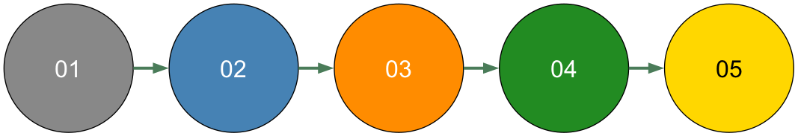
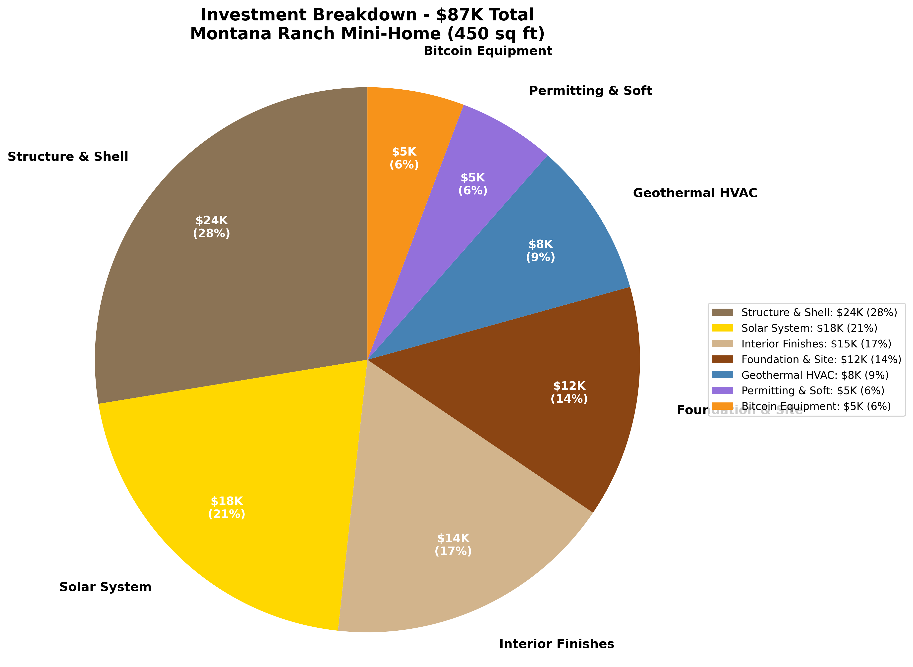

# Homepage Copy - Offgrid Farmstays

## Navigation Bar
**Logo**: Offgrid Farmstays
**Menu**: About | What We Build | Projects | Resources | Get Started

**CTA Button** (Orange, prominent): Schedule Free Consultation

---

## Hero Section

### Headline (Large, Bold)
**Turn Idle Land Into $4,000+/Month Passive Income**

### Subheadline (Medium, supporting)
We build bitcoin-powered off-grid retreats with solar energy, geothermal systems, and guest booking integration—handling permitting, construction, and everything in between.

### Visual

*Montana mountain retreat at golden hour - solar panels integrated into roof design, warm interior lighting*

### Primary CTA
[Large Orange Button] **Get Your Free Land Assessment**

### Secondary CTA
[Text Link Below] See How It Works →

### Trust Bar (Below CTAs, icons with text)
✓ 50+ Projects Completed
✓ Master Engineers on Staff
✓ Partners: [AirBTC Logo] [Exergy Logo]

---

## Section 2: The Problem (Empathy)

### Headline
**Your Land Has Untapped Potential**

### 3-Column Pain Point Layout

**Column 1**
🏞️ **Underutilized Acres**
You own beautiful property that costs you in taxes and maintenance but generates minimal income. What if it could pay for itself—and then some?

**Column 2**
⚡ **Rising Energy Costs**
Electricity bills keep climbing while your land sits in sunshine. Your property could be producing clean energy and turning it into revenue 24/7.

**Column 3**
📋 **Permitting Paralysis**
You've thought about building a rental or ADU, but the zoning rules, building codes, and regulatory maze feel impossible to navigate alone.

### Transition Text
**There's a better way. And it's already working for landowners across the country.**

---

## Section 3: The Solution (Value Proposition)

### Headline
**Bitcoin-Powered Retreats That Pay for Themselves**

### Intro Paragraph
Offgrid Farmstays designs and builds turnkey off-grid mini-homes and glamping retreats that generate dual income streams: guest bookings through AirBTC and bitcoin earnings from excess solar production. We handle everything—design, permitting, construction, energy systems, and guest booking integration.

### Visual
[Diagram: Property Transformation Flow]
- Before: Vacant land photo
- Arrow: "We Transform"
- After: Beautiful retreat with annotations showing solar panels, guests, bitcoin mining, revenue streams

### 4-Column Service Overview

**Column 1: Custom Design**
🏗️
Property-specific architectural plans optimized for solar exposure, guest experience, and local regulations. 3D renderings before you commit.

**Column 2: Energy Engineering**
☀️
Solar arrays, geothermal systems, and immersion-cooled bitcoin mining with heat reuse. Master engineers design for maximum efficiency and ROI.

**Column 3: Permitting Navigation**
✅
We handle zoning variances, building permits, inspections, and regulatory compliance. You avoid the headaches; we know the system.

**Column 4: Revenue Activation**
💰
AirBTC listing optimization, bitcoin mining commissioning, owner training. You start earning from day one after completion.

### CTA
[Button] Learn More About Our Process →

---

## Section 4: Dual Revenue Model (Differentiation)

### Headline
**Two Income Streams From One Property**

### Visual Split Layout

*Interactive diagram showing how guest bookings and bitcoin earnings combine for total monthly revenue*

**Left Side: Guest Bookings**

**AirBTC Platform**
💵 $2,800/month average
🏡 60-80% typical occupancy
⭐ Bitcoin-native travelers worldwide

Your retreat generates income through short-term rentals. We set up your listing, optimize pricing, and train you on hosting best practices.

---

**Center: The Property**
[Large central image of completed retreat with solar panels visible]

**Your Off-Grid Retreat**
Clean energy → Dual revenue
Guest comfort + Bitcoin earnings
Built to last 50+ years

---

**Right Side: Bitcoin Earnings**
[Image: Energy dashboard showing solar production, bitcoin logo]

**Excess Solar Production**
₿ $1,400/month average
⚡ 24/7 passive income
🔥 Heat reused for hot water

Solar panels overproduce for your retreat's needs. Excess energy powers bitcoin mining equipment, earning you digital currency that appreciates over time.

### Bottom Callout Box (Highlighted)
**Combined Monthly Income: $4,200**
**Annual Revenue: $50,400**
**Typical Payback Period: 2-3 Years**

### CTA
[Button] Calculate Your Property's Potential →

---

## Section 5: How It Works (Process Overview)

### Headline
**From Consultation to First Guest in 6-8 Months**

### Timeline Visual (Horizontal with Icons)

*5-phase build process from discovery to launch*

**Step 1: Free Assessment**
📍 Week 1-2
We visit your property, analyze solar potential, discuss your vision, and deliver a feasibility report. No cost, no obligation.

**Step 2: Custom Proposal**
📐 Week 3-6
3D renderings, floor plans, energy system design, itemized budget, and revenue projections tailored to your property.

**Step 3: Permitting**
📋 Week 7-18
We handle all zoning applications, building permits, and regulatory approvals. You stay informed; we do the work.

**Step 4: Construction**
🏗️ Week 19-34
From foundation to finish, we manage contractors, install energy systems, and ensure quality at every milestone.

**Step 5: Launch & Earn**
🎉 Week 35-38
AirBTC listing goes live, bitcoin mining activates, you welcome your first guests, and revenue starts flowing.

### Bottom Text
Average timeline: 6-8 months from signing to first booking.
We keep you updated at every phase.

### CTA
[Button] See the Complete Process →

---

## Section 6: Featured Projects (Social Proof)

### Headline
**Real Properties, Real Results**

### Subheadline
We've built 50+ retreats across the country. Here are three that showcase what's possible.

### 3-Project Showcase (Large Cards)

---

**Project Card 1: Montana Ranch Retreat**

[Large hero image: Stunning luxury cabin with mountain backdrop, solar panels on roof]

**Location**: Montana Ranch (25 acres)
**Type**: 450 sq ft luxury mini-home
**Built**: 2024

**Investment**: $87,000

**Monthly Revenue**:
- Guest bookings: $2,800
- Bitcoin earnings: $1,400
- **Total: $4,200/month**

**ROI**: Payback in 2.1 years

*Investment payback timeline showing breakeven at 2.1 years, with 5-year and 7-year return projections*

**The Story**:
Third-generation rancher (58) wanted retirement income without selling land. Had zero bitcoin experience and was skeptical about permitting. We navigated county approvals in 10 weeks, completed construction in 5 months. Now he's planning unit #2.

**Systems**:
- 18 kW solar array
- Geothermal heating
- 4 immersion-cooled miners
- Heat reuse for hot water

[Button] Read Full Case Study →

---

**Project Card 2: Vermont Maple Farm**

[Image: Two glamping tents in forest clearing, solar panels in background]

**Location**: Vermont Maple Farm (40 acres)
**Type**: 2 glamping units (400 sq ft each)
**Built**: 2023

**Investment**: $112,000 (both units + solar)

**Monthly Revenue**:
- Guest bookings: $4,250
- Bitcoin earnings: $1,000
- **Total: $5,250/month**

**ROI**: Payback in 1.8 years

**The Story**:
Family-owned maple syrup operation only ran Feb-Apr. Wanted year-round income. We built glamping retreats that capture fall foliage tourism. Mining heat pre-warms maple sap in spring. 71% occupancy in year one.

**Systems**:
- 24 kW solar array
- 6 bitcoin miners
- Shared bathhouse
- Agricultural heat integration

[Button] Read Full Case Study →

---

**Project Card 3: Oregon Coast Glamping**

[Image: Three A-frame cabins on hillside overlooking coastline]

**Location**: Oregon Coast (5 acres)
**Type**: 3 A-frame cabins (320 sq ft each)
**Built**: 2022-2024 (phased)

**Investment**: $165,000 (all three units)

**Monthly Revenue**:
- Guest bookings: $6,800
- Bitcoin earnings: $600
- **Total: $7,400/month**

**ROI**: Payback in 1.9 years

**The Story**:
Owner built one cabin first to test market. 80% occupancy and 4.9-star reviews gave confidence to add two more. Staggered construction minimized risk. Now a thriving micro-resort 15 minutes from beach town.

**Systems**:
- 20 kW shared solar
- Individual battery backup
- 3 air-cooled miners
- Coastal wind-rated construction

[Button] Read Full Case Study →

---

### Bottom CTA
[Button] View All 50+ Projects →

---

## Section 7: Energy Systems (Technical Credibility)

### Headline
**Built on Clean Energy, Engineered for Profit**

### Intro Text
Our master engineers integrate renewable energy systems with bitcoin mining technology to maximize your property's income potential while reducing your carbon footprint to zero—or negative.

### Tabbed Interface (3 Tabs, click to expand)

---

**Tab 1: Solar Energy** ☀️

[Image: Workers installing solar panels on retreat roof]

**How It Works**:
Photovoltaic panels convert sunlight into electricity. Inverters make it compatible with standard appliances. Your retreat uses what it needs; excess powers bitcoin mining equipment that earns revenue 24/7.

**Our Approach**:
- Custom sizing based on property location and energy needs
- Premium monocrystalline panels (25-year warranties)
- Microinverters for panel-level optimization
- Real-time monitoring dashboards

**Typical System**:
- 15-25 kW capacity
- Produces 50-100 kWh per day
- Powers retreat + 4-8 bitcoin miners
- $18,000-$35,000 investment
- 3-5 year payback through guest comfort + bitcoin earnings

**Real Example**:
Montana project produces 2,400 kWh/month. Retreat uses 600 kWh. Mining uses 1,500 kWh. Battery stores 300 kWh. Total value: $350/month utility offset + $1,400/month bitcoin = $1,750/month from a $27,000 array.

---

**Tab 2: Geothermal Heating** 🌍

[Image: Geothermal installation with ground loops]

**How It Works**:
Underground pipes tap the earth's constant 50-55°F temperature. Heat pumps transfer this stable thermal energy to heat or cool your retreat efficiently—using 75% less energy than traditional HVAC.

**Our Approach**:
- Vertical bore or horizontal loop design (site-dependent)
- Closed-loop systems (no groundwater interaction)
- Integration with bitcoin mining heat reuse
- Radiant floor heating for luxury guest experience

**Typical System**:
- 3-5 ton capacity
- 400-600 ft vertical bore depth
- Heats and cools 400-800 sq ft
- $12,000-$22,000 investment
- Pays for itself through energy savings + guest satisfaction

**Why It Matters**:
Guests pay premium rates for comfort. Geothermal provides silent, consistent climate control. Combined with mining heat reuse, your heating costs approach zero while commanding $200+/night rates.

---

**Tab 3: Immersion Cooling & Heat Reuse** 🔥

[Image: Immersion cooling tanks with miners submerged, heat exchanger pipes]

**How It Works**:
Bitcoin miners generate intense heat—usually wasted. We submerge them in non-conductive fluid that captures 95% of thermal energy. Heat exchangers transfer this to your domestic hot water, space heating, or even greenhouse warming.

**Our Approach**:
- Partnership with Exergy (industry-leading immersion tech)
- Custom heat recovery design per property needs
- Whisper-quiet operation (no fan noise)
- Extended miner lifespan (cooler components)

**Typical System**:
- 4-8 miners in immersion tanks
- 40,000-80,000 BTU/hr heat output
- Provides 60-100% of hot water needs
- Eliminates $150-$300/month in propane costs

**The Math**:
Miners earn $1,400/month in bitcoin AND eliminate $180/month in water heating costs. That's $1,580/month from equipment that would otherwise just consume energy. This is the future of distributed energy.

**Guest Experience**:
Unlimited hot water. Heated floors. Warm spa/hot tub. All "free" byproducts of bitcoin mining. Guests never know the system exists—they just enjoy the comfort.

---

### Bottom CTA
[Button] Explore Our Technology in Detail →

---

## Section 8: Landowner Testimonials (Trust)

### Headline
**What Landowners Are Saying**

### 3-Testimonial Cards (with photos)

---

**Testimonial 1**

[Photo: Sarah standing on deck of Montana cabin, mountain view behind]

> "I had 20 acres doing nothing but costing me in property taxes. I knew I should build something but the permitting scared me off. Offgrid Farmstays handled everything—I just approved designs and showed up for the ribbon cutting. Now I have a retreat generating $3,800 a month and guests leave glowing reviews. The permitting was actually smooth—they knew exactly what they were doing. Best decision I've made for this property in 15 years."

**Sarah M.**
Montana Ranch Owner
Project Completed: 2024
Monthly Revenue: $3,800

---

**Testimonial 2**

[Photo: Tom standing next to solar array in snowy Vermont landscape]

> "I was skeptical about bitcoin—thought it was fake internet money. But the numbers worked even without it. The guest revenue alone pays for the build in 3 years. The mining is just a bonus that heats my hot tub for free and adds another $1,000 a month. My maple syrup customers love staying on the farm during fall foliage season. It's become a whole new revenue stream I never imagined."

**Tom R.**
Vermont Maple Farm (4th Generation)
Project Completed: 2023
Monthly Revenue: $5,250

---

**Testimonial 3**

[Photo: Linda sitting on porch of A-frame cabin, ocean visible in distance]

> "From dirt to first guest in 5 months. They managed every detail—I just approved milestones and watched it come together. I built one cabin to test the market, and it booked at 80% occupancy immediately. That gave me confidence to add two more. Now I have a mini-resort that runs itself. Best investment I've made in 20 years of owning this property. The AirBTC platform brings me guests from all over the world who love paying in bitcoin."

**Linda K.**
Oregon Coast Landowner
Project Completed: 2022-2024
Monthly Revenue: $7,400

---

### Bottom Text
[Button] Read More Success Stories →

---

## Section 9: Interactive ROI Calculator (Lead Magnet)

### Headline
**See What Your Property Could Generate**

### Intro Text
Every property is unique. Use our calculator to get a custom estimate based on your location, land size, and budget. Takes 60 seconds.

### Calculator Interface (Left/Right Split)

**Left Side: Input Fields**

**Your Property**
📍 State/Region: [Dropdown menu]
📏 Land Size: [Slider: 1-50+ acres]
🏡 Existing Structures? [Yes/No toggle]
⚡ Utility Access: [Grid / Off-Grid / Hybrid]

**Your Project**
🏠 Retreat Type: [Dropdown: Mini-Home / Glamping / Multi-Unit]
📐 Square Footage: [Slider: 200-800 sq ft]
💰 Your Budget: [Slider: $40K-$200K+]

**Revenue Assumptions**
🛏️ Nightly Rate Estimate: [Auto-fills based on region, editable]
📅 Occupancy % Estimate: [Slider: 40%-80%, defaults to 65%]
₿ Include Bitcoin Mining? [Yes/No toggle]

---

**Right Side: Live Results (Updates as inputs change)**

### Your Custom Projection

**Estimated Investment**: $87,000

**Monthly Revenue (Year 1)**
Guest Bookings: $2,800/month
Bitcoin Earnings: $1,200/month
**Total: $4,000/month**

**Annual Revenue**: $48,000/year

**Operating Expenses**: $8,500/year
(Maintenance, insurance, platform fees)

**Net Cash Flow**: $39,500/year

**Return Metrics**
💡 Simple Payback: 2.2 years
📈 5-Year Total Return: $197,500
💰 5-Year ROI: 227%

*Interactive calculator showing investment vs cumulative revenue with breakeven point*

*Typical $87K investment allocation: Structure ($24K), Solar ($18K), Interior ($15K), Foundation ($12K), HVAC ($8K), Permitting ($5K), Bitcoin Equipment ($5K)*

---

### Disclaimer Text (Small)
*Projections based on historical data from similar projects. Actual results vary by location, management, market conditions, and bitcoin price. Conservative assumptions used. Not financial advice.*

### CTA
[Large Orange Button] **Get Your Custom PDF Report**

[Small text below] Enter your email to download a detailed breakdown →

### Email Capture Modal (Appears on button click)

**Almost there!**

Get your custom analysis as a detailed PDF report, plus:
✓ Itemized cost breakdown for your project type
✓ Regional market analysis and nightly rate data
✓ Energy production estimates for your location
✓ Next steps to get started

**Email**: [Input field]
**Name** (optional): [Input field]
**Phone** (optional): [Input field]

[Button] Send Me the Report

[Small text] We respect your privacy. No spam, ever. Unsubscribe anytime.

---

## Section 10: FAQ Snapshot (Objection Handling)

### Headline
**Common Questions Answered**

### Accordion-style (6 questions, click to expand)

---

**Q1: What's the typical total investment range?**

Most projects range from $65,000 to $150,000 depending on size, location, and systems complexity.

Breakdown:
- **Budget Option** ($40K-$65K): Small glamping structure (250-350 sq ft), basic solar, air-cooled mining
- **Standard Build** ($65K-$100K): 400-500 sq ft mini-home, full solar + geothermal, immersion cooling
- **Premium Build** ($100K-$150K+): 600-800 sq ft, multi-unit, or challenging site conditions

We provide itemized quotes with zero hidden costs. Financing and partnership options available.

---

**Q2: How long does the entire process take?**

Average timeline: **6-8 months** from contract signing to first guest.

- Permitting: 8-16 weeks (varies by jurisdiction)
- Construction: 12-18 weeks
- Systems commissioning: 2-3 weeks

Some jurisdictions are faster (4 months total), others slower (12 months). We give you honest timelines based on your specific location during the proposal phase.

---

**Q3: Do I need to understand bitcoin to do this?**

No. Many of our clients had zero bitcoin knowledge before starting.

What we handle:
- Equipment selection and setup
- Mining pool configuration
- Wallet setup and security
- Performance monitoring
- Heat reuse engineering

What you do:
- Approve the design (we explain it simply)
- Receive monthly earnings reports
- Decide when to convert bitcoin to dollars (we recommend partners)

Think of it like solar panels—you don't need to understand photovoltaic physics to benefit from the electricity. We handle the technical complexity.

---

**Q4: What if bitcoin prices crash?**

Our projects succeed independent of bitcoin price because of dual revenue streams.

**Real example**: Oregon client's retreat remained cash-flow positive during 2022 bear market (BTC dropped to $16K) because guest bookings covered all costs. Bitcoin was bonus, not foundation.

**Our conservative approach**:
- Financial models use $30K-$40K BTC price (historically low)
- Guest revenue typically represents 60-70% of total income
- Heat reuse provides $100-$300/month value regardless of BTC price
- Energy systems have value even without mining (guest comfort, utility offset)

**Bottom line**: Bitcoin enhances returns during bull markets. Project fundamentals work without it.

---

**Q5: What about permitting in my area?**

Permitting is our specialty—we've successfully navigated 50+ jurisdictions.

**Common scenarios we handle**:
- Agricultural zoning (conditional use permits)
- Remote locations (septic, access road approvals)
- Coastal/mountain zones (special wind/snow ratings)
- Historic districts (design review boards)
- Off-grid utilities (alternative power approvals)

**Our process**:
1. Pre-application meeting with local officials (we attend with you)
2. Custom application packages (engineered plans, site surveys)
3. We manage back-and-forth with planning departments
4. You stay informed but we do the legwork

**Timeline**: We give honest estimates during assessment. If your jurisdiction is extremely difficult, we'll tell you upfront.

---

**Q6: Can I see proof of other clients' earnings?**

Yes—with client permission, we share real financial data.

**What we can show you**:
- Detailed case studies with actual revenue numbers
- AirBTC booking screenshots (with guest names redacted)
- Energy production dashboards
- Bitcoin earnings reports
- 6-month and 1-year updates

**During consultation**: We connect you with past clients (references) who volunteered to answer questions from prospective landowners.

**Our transparency commitment**: We never guarantee specific returns, but we show you conservative, moderate, and optimistic scenarios based on real comparable projects.

---

### Bottom CTA
[Button] See All FAQs →

---

## Section 11: Partners & Credibility

### Headline
**Trusted Partnerships, Proven Technology**

### Partner Showcase (Logo + Description, 3 columns)

**AirBTC**
[AirBTC Logo]

The leading bitcoin-native booking platform for short-term rentals. Accept bitcoin payments from global travelers, avoid 12-15% credit card fees, and tap into a passionate community of bitcoin tourists seeking unique stays.

We handle your entire AirBTC setup, listing optimization, and pricing strategy.

---

**Exergy**
[Exergy Logo]

Industry-leading immersion cooling technology for bitcoin mining. Their systems capture 95% of heat output for reuse—turning waste into hot water, space heating, and agricultural applications.

We exclusively use Exergy for all immersion cooling installations.

---

**Master Engineers**
[Engineering Seal Icon]

Our in-house team includes licensed structural, electrical, and mechanical engineers with decades of combined experience in renewable energy, off-grid construction, and bitcoin mining.

Every project engineered to code, built to last 50+ years.

---

### Press & Recognition (if available)

**As Featured In**:
[Bitcoin Magazine Logo] [Solar Power World Logo] [Local News Outlet]

---

## Section 12: Final CTA (Conversion Focus)

### Headline
**Ready to Transform Your Property?**

### Subheadline
Schedule a free land assessment. No cost, no obligation—just honest analysis of your property's potential from experienced engineers who've done this 50+ times.

### Visual
[Image: Team member reviewing site plans with smiling landowner at property, landscape in background]

### Two-Column Layout

**Left Column: What You Get (Checklist)**

**Your Free Assessment Includes**:
✅ Property solar potential analysis
✅ Preliminary design concepts for your land
✅ Budget and timeline estimates
✅ Permitting roadmap for your jurisdiction
✅ Revenue projections customized to your property
✅ Honest feedback—we'll tell you if it's not a fit

**Typical Duration**: 60-90 minutes
**Format**: Video call + optional site visit
**Cost**: $0

---

**Right Column: CTA Form**

**Schedule Your Consultation**

**Your Information**:
Name: [Input]
Email: [Input]
Phone: [Input]

**Your Property**:
Property State/Region: [Dropdown]
Land Size (acres): [Input]
Property Address (optional): [Input]

**Your Timeline**:
When would you like to start?
[Dropdown: Next 3 months / 3-6 months / 6-12 months / Just exploring]

**Anything else we should know?** [Text area]

[Large Orange Button] **Request Free Assessment**

---

**Or Contact Us Directly**:

📞 Phone: **(555) 123-4567**
📧 Email: **info@offgridfarmstays.com**
🕐 Hours: Mon-Fri 9am-6pm MT

---

## Section 13: Final Trust Statement

### Text Block (Centered, grey background box)

**Our Commitment**

We only succeed when you succeed. That's why we're transparent about costs, timelines, and realistic revenue expectations. We've walked away from projects that didn't make financial sense for the landowner—because our reputation is built on real results, not overpromises.

Every retreat we build is a reference for the next. We treat your property like it's our own family land.

**50+ landowners trust us. Ready to be next?**

[Button] Get Started →

---

## Footer

### Column Layout (4 columns)

**Column 1: Company**
About Us
Our Team
Partners
Press & Media
Contact

**Column 2: Services**
What We Build
How It Works
Energy Systems
Permitting Services
AirBTC Integration

**Column 3: Resources**
Blog
Case Studies
ROI Calculator
FAQ
State Guides

**Column 4: Connect**
📧 Newsletter Signup
[Email input + Subscribe button]

**Follow Us**:
[Twitter] [Instagram] [YouTube] [LinkedIn]

---

**Bottom Bar**:
© 2025 Offgrid Farmstays. All rights reserved.
Privacy Policy | Terms of Service

**Tagline**: *Building wealth from land, powered by sunshine and bitcoin.*

---

## Page Metadata (SEO)

**Title Tag** (60 chars):
Bitcoin-Powered Off-Grid Retreats | Offgrid Farmstays

**Meta Description** (155 chars):
Turn idle land into $4,000+/month passive income. We build solar-powered retreats with guest bookings + bitcoin mining. Free land assessment.

**Keywords**:
bitcoin powered retreat, off-grid cabin builder, passive income land, solar rental property, glamping construction, ADU builder, bitcoin mining solar, land passive income

**Schema Markup**:
- Organization
- LocalBusiness
- Service
- FAQPage
