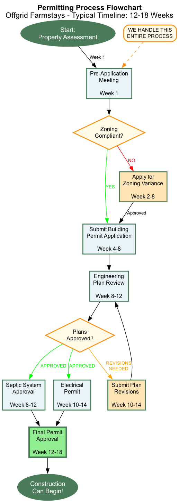

# How It Works Page - Offgrid Farmstays

## Hero Section

### Headline
**From Consultation to First Guest: Your Complete Roadmap**

### Subheadline
We've built 50+ bitcoin-powered retreats. Here's exactly what happens—timeline, process, your role, our role—with zero surprises.

### Visual

*5-phase build process: Discovery (Weeks 1-2) → Design (3-6) → Permitting (7-18) → Construction (19-34) → Launch (35-38)*

---

## Section 1: Timeline Overview

### Visual Timeline (Horizontal)

**Phase 1: Discovery** → **Phase 2: Design** → **Phase 3: Permitting** → **Phase 4: Construction** → **Phase 5: Launch**

Week 1-2 → Week 3-6 → Week 7-18 → Week 19-34 → Week 35-38

**Average Total Timeline**: 6-8 months from first call to first booking

---

## Section 2: Phase 1 - Discovery & Assessment

### Headline
**Phase 1: Discovery & Free Assessment** (Week 1-2)

### Overview
We start with a comprehensive property evaluation to determine if your land is a good fit—and if we're a good fit for you. No cost, no pressure, just honest analysis.

---

### What Happens

**Initial Consultation (30-60 min, video call)**

We discuss:
✓ Your property (size, location, current use)
✓ Your goals (income, personal use, timeline)
✓ Your budget range
✓ Your vision and aesthetic preferences
✓ Basic feasibility (solar exposure, zoning, access)

**What we need from you**:
- Property address or GPS coordinates
- Recent photos (land, views, access roads)
- Any existing survey or site plans (if available)
- Rough budget range you're comfortable with

---

**Site Visit (If promising fit)**

We visit your property to assess:
📍 **Solar Potential**: Sun exposure, shading analysis, optimal panel placement
🏞️ **Site Selection**: Best locations for structures (views, privacy, access)
🚧 **Access & Utilities**: Road quality, distance to grid (if any), water source
📋 **Regulatory Landscape**: Zoning classification, likely permit pathway
🏗️ **Site Challenges**: Slope, drainage, soil conditions, environmental constraints

**Duration**: 2-3 hours on-site + drive time
**Who attends**: You + our engineer + optionally our permitting specialist

---

**Feasibility Report (Delivered within 1 week)**

You receive a written assessment including:
- ✅ **Go/No-Go Recommendation** (we'll tell you honestly if it's not viable)
- 📊 **Preliminary Budget Range** (rough cost estimate)
- 📅 **Estimated Timeline** (based on your jurisdiction)
- 🏗️ **Conceptual Layouts** (2-3 sketch options for placement)
- ⚡ **Energy Potential** (estimated solar production)
- 📋 **Permitting Pathway** (likely approvals needed)
- 💰 **Revenue Estimate** (conservative projection)

---

### Your Decision Point

**Option 1: Proceed to Design Phase**
If the numbers work and you're excited, we move to custom proposal development. This is where we invest significant engineering time, so we ask for a refundable design deposit ($2,000-$5,000) to ensure mutual commitment.

**Option 2: Pass**
If it's not the right time, budget doesn't align, or you're not ready—no problem. You keep the feasibility report and can revisit later. We part as friends.

**Option 3: Modify & Re-evaluate**
Sometimes the initial vision doesn't pencil out, but a modified approach does (smaller build, different structure type, phased construction). We can iterate.

---

### Cost
**$0** for initial consultation and feasibility assessment.

---

## Section 3: Phase 2 - Design & Proposal

### Headline
**Phase 2: Custom Design & Proposal** (Week 3-6)

### Overview
This is where your retreat comes to life—from napkin sketch to photorealistic renderings, engineered plans, and itemized budget. You'll see exactly what you're getting before signing anything.

---

### What Happens

**Detailed Design Kick-Off (Week 3)**

We gather your detailed preferences:
- 🏠 Architectural style (modern, rustic, farmhouse, etc.)
- 📐 Space requirements (# of beds, kitchen style, amenities)
- 🎨 Material preferences (wood, metal, stone)
- 🔥 Must-have features (hot tub, sauna, outdoor kitchen, etc.)
- 💡 Inspiration images (Pinterest boards, photos, examples you love)

**Our team develops**:
1. **Floor plans** (multiple layout options if requested)
2. **3D exterior renderings** (photorealistic, multiple angles)
3. **Interior renderings** (key spaces visualized)
4. **Site plan** (building placement, solar array, parking, landscaping)

---

**Energy Systems Engineering (Week 4-5)**

Our engineers design:
⚡ **Solar Array**
- Panel count, layout, mounting system
- Production modeling (monthly kWh estimates)
- Battery storage sizing (if desired)
- Cost breakdown

🌡️ **Heating/Cooling System**
- Geothermal or mini-split design
- Load calculations (BTU requirements)
- Integration with bitcoin heat reuse
- Cost breakdown

₿ **Bitcoin Mining Setup**
- Miner selection (ASIC models, hash rate)
- Immersion vs. air cooling recommendation
- Heat recovery system design (hot water, radiant floors, etc.)
- Earnings projection (conservative bitcoin price)
- Cost breakdown

🔌 **Electrical & Plumbing**
- Full electrical plan (service panel, circuits, outlets)
- Plumbing layout (water supply, drain, septic)
- Compliance with local codes

---

**Permitting Strategy (Week 5)**

Our permitting specialist researches:
- 📋 Required permits (building, electrical, septic, zoning variance, etc.)
- 📅 Estimated approval timeline for your jurisdiction
- 💰 Permit fee estimates
- 🚧 Potential challenges and mitigation strategies
- 🤝 Pre-application meeting recommendations (with planning department)

---

**Comprehensive Proposal Delivery (Week 6)**

You receive a complete package (20-40 page PDF):

**Section 1: Executive Summary**
- Project overview (what we're building)
- Total investment required
- Revenue projections (guest + bitcoin)
- ROI and payback timeline
- Construction timeline

**Section 2: Design Visuals**
- 3D renderings (exterior, 3-4 angles)
- Interior renderings (living, kitchen, bath, bedroom)
- Floor plans with dimensions
- Site plan with annotations
- Material palette

**Section 3: Technical Specifications**
- Complete energy system design
- Structural specs and materials
- Appliances and fixtures list
- Finishes and details

**Section 4: Itemized Budget**
- Site preparation: $X
- Foundation: $X
- Structure & framing: $X
- Exterior finishes: $X
- Interior finishes: $X
- Solar system: $X
- Geothermal/HVAC: $X
- Bitcoin equipment: $X
- Electrical & plumbing: $X
- Septic/water: $X
- Permitting fees: $X
- Design & engineering: $X
- Project management: $X
- Contingency (5-10%): $X
- **Total Investment: $XXX,XXX**

**Section 5: Revenue Projections**
- Nightly rate analysis (comps in your area)
- Occupancy estimates (conservative, moderate, optimistic)
- Guest revenue projections (monthly/annual)
- Bitcoin mining revenue (3 price scenarios)
- Operating expenses
- Net cash flow and ROI calculations

**Section 6: Timeline**
- Gantt chart showing phases
- Key milestones and decision points
- Your approval checkpoints

**Section 7: Next Steps**
- Contract overview
- Payment schedule
- What we need from you to proceed

---

### Proposal Review Meeting (Week 6)

We schedule a 60-90 minute call to walk through the proposal:
- Answer all questions
- Discuss any modifications you'd like
- Explain financing options if needed
- Provide references (past clients you can call)

**You can**:
- ✅ Accept and move to contract
- 🔄 Request modifications (we revise at no charge—within reason)
- ⏸️ Take time to think (we don't pressure)
- ❌ Decline (design deposit refunded if we materially misrepresented feasibility)

---

### Cost
**Design Deposit**: $2,000-$5,000 (applied to total project cost if you proceed; refundable if we can't deliver a viable proposal)

---

## Section 4: Phase 3 - Permitting & Approvals

### Headline
**Phase 3: Permitting & Regulatory Approval** (Week 7-18)

### Overview
This is often the most stressful phase for landowners doing it alone—but the easiest for you with us. We handle all applications, follow-ups, revisions, and approvals. You stay informed but don't do the work.

*Decision tree showing the permitting pathway from property assessment through final approval*

---

### What Happens

**Pre-Application Meeting (Week 7)**

We (often with you) meet with local planning staff:
- Present conceptual plans
- Discuss zoning compliance
- Identify potential issues early
- Build rapport with officials (critical for smooth approvals)

**Goal**: Turn "maybe" into "yes, if you do X" before formal application.

---

**Permit Applications Submitted (Week 8-9)**

We prepare and submit:
📋 **Building Permit Application**
- Engineered plans (stamped by our PE)
- Structural calculations
- Energy compliance forms
- Site plan and survey

🔌 **Electrical Permit**
- Solar system design
- Electrical panel load calculations
- Wiring diagrams

🚰 **Septic/Plumbing Permit** (if applicable)
- Percolation test results (we coordinate)
- Septic system design
- Well permit (if needed)

📍 **Conditional Use Permit / Variance** (if required)
- Justification for non-conforming use
- Neighbor notification (if required)
- Public hearing preparation (we present or coach you)

🌲 **Environmental Reviews** (if applicable)
- Wildlife impact assessments
- Wetland delineation
- Stormwater management plans

---

**The Waiting Game (Week 10-16)**

**What we do**:
- Track application status (weekly check-ins with planning dept)
- Respond to review comments (plan revisions if requested)
- Coordinate additional documentation (engineering letters, surveys, etc.)
- Keep you updated (weekly status emails)

**What you do**:
- Wait (frustrating but necessary)
- Respond to any direct requests from county (rare—we handle most)
- Attend public hearing if required for CUP/variance (we prep you)

**Timeline varies wildly by jurisdiction**:
- ⚡ Fast counties (rural, landowner-friendly): 4-8 weeks
- 🐌 Slow counties (urban, strict regulations): 12-20 weeks
- ⏱️ Average: 8-12 weeks

---

**Permits Approved! (Week 12-18)**

You receive:
✅ Building permit (approved plans with official stamp)
✅ Electrical permit
✅ Septic approval (if applicable)
✅ Conditional use permit or variance (if needed)
✅ Any other required approvals

**We schedule**:
- Pre-construction meeting with contractors
- Site prep start date
- Material orders placed

---

### Your Role in This Phase
- **Minimal active involvement** (we do the heavy lifting)
- Review and approve any plan changes requested by planning dept
- Attend public hearing if required (we prep you, usually not needed)
- Stay patient (permitting is unpredictable—we manage expectations)

---

### Cost
**Included in project price**:
- All permit preparation and applications
- Engineering plan stamping
- Our time managing the process

**Your direct costs** (separate from our contract):
- Government permit fees: $2,000-$8,000 (varies by jurisdiction—we estimate in proposal)
- Percolation tests, surveys (if needed): $1,000-$3,000
- Public notice fees (if required): $200-$500

---

## Section 5: Phase 4 - Construction

### Headline
**Phase 4: Construction & Installation** (Week 19-34)

### Overview
This is where your retreat goes from blueprints to reality. We manage every trade, every delivery, every inspection—you watch the progress and approve milestones.

---

### The Build Sequence

**Week 19-21: Site Preparation**

What happens:
- Access road improvements (if needed)
- Site clearing and grading
- Trenching for utilities
- Staking building footprint

**You see**:
- Heavy equipment on-site
- Land leveled and prepared
- Utility lines trenched

**Milestone**: Site prep complete, foundation ready

---

**Week 22-24: Foundation**

What happens:
- Concrete forms built
- Rebar placed and inspected
- Foundation poured
- Curing period
- Foundation inspection passed

**You see**:
- Concrete slab or pier foundation in place
- Plumbing rough-ins stubbed up

**Milestone**: Foundation inspection approved

---

**Week 25-28: Framing & Structural**

What happens:
- Floor joists and subfloor (if raised foundation)
- Wall framing erected
- Roof trusses installed
- Sheathing and weatherproofing
- Windows and doors installed
- Framing inspection

**You see**:
- Building takes shape (exciting phase!)
- Roof goes on (weathertight)
- Windows in

**Milestone**: Framing inspection approved, building dried-in

---

**Week 29-31: Systems Installation**

What happens:
- Solar panels installed and racked
- Electrical wiring (rough-in)
- Plumbing lines run
- HVAC/geothermal installation
- Bitcoin mining equipment delivered
- Septic system installed (if applicable)
- Insulation installed
- Systems rough-in inspections

**You see**:
- Solar array mounted
- Mechanical equipment in place
- Building insulated and ready for finishes

**Milestone**: Rough-in inspections passed

---

**Week 32-34: Finishes & Final Systems**

What happens:
- Drywall installed, taped, painted
- Flooring installed
- Kitchen and bath fixtures
- Lighting and electrical trim-out
- Final plumbing connections
- Bitcoin mining commissioning
- Solar system activation
- Appliances installed
- Exterior siding and trim complete

**You see**:
- Interiors taking final form
- Paint colors, flooring
- Kitchen and bath coming together
- Solar producing power!

**Milestone**: Final inspections

---

**Week 35: Final Inspections & Certificate of Occupancy**

What happens:
- Final building inspection
- Final electrical inspection
- Final plumbing inspection
- Certificate of Occupancy issued
- Final walkthrough with you
- Punch list items addressed

**You see**:
- Completed retreat (move-in ready!)
- We demonstrate all systems

**Milestone**: CO issued, project complete

---

### Communication During Construction

**Weekly Updates**:
- Photo updates (progress pics)
- Status email (what's done, what's next)
- Any issues or decisions needed

**Your Involvement**:
- Approve material selections (before ordering)
- Visit site anytime (we encourage it!)
- Final walkthrough and approval
- Punch list review (minor touch-ups if needed)

**On-Site Management**:
- Our construction manager visits 2-4x per week
- Daily coordination with trades
- Quality control checks
- Problem-solving in real-time

---

### What Could Cause Delays?

**Weather**: Heavy snow, rain, or extreme cold can pause concrete pours or exterior work
**Permitting**: Unexpected inspection delays or failed inspections (rare for us)
**Material Availability**: Supply chain issues (we order long-lead items early)
**Site Surprises**: Unexpected bedrock, underground springs, etc.

**How we manage**:
- Build contingency time into schedules
- Communicate delays immediately
- Adjust timeline proactively
- Never compromise quality to make up time

---

### Cost
**Construction costs** are itemized in your proposal and locked in via fixed-price contract.

**Payment Schedule** (typical):
- 10% deposit at contract signing
- 20% at foundation complete
- 30% at framing complete
- 20% at rough-in complete
- 15% at final completion
- 5% holdback (released 30 days post-CO)

---

## Section 6: Phase 5 - Launch & Revenue Activation

### Headline
**Phase 5: Launch & Start Earning** (Week 35-38)

### Overview
Your retreat is built—now we activate revenue streams. We handle AirBTC listing setup, bitcoin mining commissioning, and owner training so you're ready to welcome guests and earn from day one.

---

### What Happens

**Systems Training (Day 1 post-CO)**

We spend 2-4 hours on-site teaching you:
⚡ **Solar System**
- How to read your monitoring dashboard
- What to do if panels need cleaning
- Battery management (if applicable)
- What's normal vs. what requires a call to us

₿ **Bitcoin Mining**
- How to check mining performance
- Understanding your mining pool dashboard
- Monthly bitcoin earnings reports
- When and how to convert BTC to USD (we recommend partners)
- Heat reuse system operation

🌡️ **HVAC/Geothermal**
- Thermostat operation
- Maintenance schedule (filter changes, annual checks)
- Troubleshooting basics

🔧 **General Systems**
- Water system (well pump or connection)
- Septic care (do's and don'ts)
- Appliance manuals and warranties
- Emergency shut-offs and contacts

---

**AirBTC Listing Creation (Week 36)**

Our client success manager:
📸 **Photography**
- Professional listing photos (we arrange photographer)
- Interior and exterior shots
- Amenity highlights
- Landscape beauty

✍️ **Listing Copywriting**
- Compelling title and description
- Amenities list (emphasize unique features)
- House rules and policies
- Check-in/check-out instructions

💰 **Pricing Strategy**
- Competitive analysis (comparable listings in your area)
- Seasonal pricing recommendations
- Minimum stay policies
- Discounts for longer stays or last-minute bookings

🎯 **Optimization**
- SEO keywords for AirBTC search
- Instant book vs. request to book
- Cancellation policy recommendations
- Guest communication templates

**Your listing goes live** within 7-10 days of CO.

---

**Owner Hosting Training (Week 37)**

We coach you on:
🏠 **Guest Preparation**
- Cleaning and staging between guests
- Stock supplies (toilet paper, firewood, etc.)
- Welcome packet ideas
- Local recommendations guide

📞 **Communication**
- Responding to booking inquiries
- Pre-arrival messages (directions, check-in)
- During-stay support (how to handle issues)
- Post-stay reviews (encouraging 5-star feedback)

🔑 **Check-In/Check-Out**
- Keyless entry setup (smart locks)
- Check-in instructions clarity
- Checkout procedures
- Turnover timeline

🛠️ **Maintenance**
- Routine cleaning vendors (we recommend local)
- Seasonal prep (winterizing, spring opening)
- Repair protocols
- Emergency contact list

---

**First Booking Celebration! (Week 38+)**

📅 Your first guest books
💵 You receive your first payment (in bitcoin via AirBTC!)
⭐ Your first 5-star review
📊 You see your first bitcoin earnings deposit

**We're available for**:
- Questions as they arise (first 90 days especially)
- Troubleshooting any system hiccups
- Optimization tips based on performance
- Expansion planning (if you want to add units)

---

### Ongoing Support (Post-Launch)

**What's Included**:
✅ System performance monitoring (we check remotely)
✅ Annual site visit and system tune-up
✅ Email/phone support for questions
✅ Bitcoin mining optimization (software updates, pool changes)
✅ Help with booking platform changes or issues

**Optional Paid Services**:
- Property management (cleaning, guest communication)
- Maintenance contracts (seasonal checks, repairs)
- Marketing support (photography updates, listing refresh)
- Expansion projects (additional units)

---

## Section 7: Your Role Throughout (Summary)

### What You Do

**Phase 1 (Discovery)**:
- Provide property info and photos
- Attend site visit
- Review feasibility report and decide to proceed

**Phase 2 (Design)**:
- Share design preferences and inspiration
- Review proposal and ask questions
- Approve design or request modifications
- Sign contract if proceeding

**Phase 3 (Permitting)**:
- Approve any plan changes requested by county
- Attend public hearing if required (rare)
- Stay patient (we manage the bureaucracy)

**Phase 4 (Construction)**:
- Approve material selections
- Visit site when you want (encouraged!)
- Review weekly updates
- Final walkthrough and punch list

**Phase 5 (Launch)**:
- Attend systems training
- Approve AirBTC listing before it goes live
- Learn hosting best practices
- Welcome your first guests!

**Total Active Time Required from You**: 20-30 hours over 6-8 months

---

## Section 8: What We Do (Summary)

### Our Responsibilities

**Phase 1**: Site visit, solar analysis, feasibility report
**Phase 2**: Design, 3D renderings, engineering, proposal
**Phase 3**: All permit applications, revisions, approvals
**Phase 4**: Contractor management, quality control, inspections
**Phase 5**: AirBTC setup, systems training, ongoing support

**Total Hours We Invest**: 300-500 hours per project (design, engineering, permitting, construction management, training)

---

## Section 9: Real Timeline Examples

### Headline
**Actual Project Timelines (From Our Portfolio)**

### 3 Case Examples

**Montana Ranch Retreat**
- Site visit: March 15
- Proposal approved: April 12
- Permits approved: June 8
- Construction start: June 15
- CO issued: September 22
- First guest: October 5
- **Total: 6.5 months**

**Vermont Glamping**
- Site visit: May 1
- Proposal approved: May 28
- Permits approved: July 15 (faster for temporary structures)
- Construction start: July 20
- CO issued: September 8
- First guest: September 15
- **Total: 4.5 months**

**Oregon Multi-Unit** (3 cabins, phased)
- Site visit: February 10
- Proposal approved: March 20
- Permits approved: June 30 (complex multi-dwelling approval)
- Cabin 1 complete: September 15
- Cabin 2 complete: November 20
- Cabin 3 complete: February 10 (next year)
- **Total: 12 months (phased), 7 months per cabin after permitting**

---

## Section 10: FAQs About the Process

**Q: Can I speed up the timeline?**
A: Permitting is the bottleneck—we can't control county processing times. However, we can sometimes overlap design and permitting (design-build approach) to save 2-4 weeks. Construction can be expedited by adding crews (at additional cost).

**Q: What if I need to pause the project mid-stream?**
A: You can pause, but timing matters. Before permitting? Easy, minimal cost. During permitting? We can pause applications. During construction? Challenging—open sites create liability and weather exposure. We discuss exit clauses in contracts.

**Q: What happens if permits are denied?**
A: Has never happened to us (100% approval rate over 50 projects). If it did, we'd either modify the design to meet objections or refund your permitting fees. We're very good at reading jurisdictions during feasibility phase—we won't proceed if approval is unlikely.

**Q: Can I act as my own general contractor to save money?**
A: Not with us. Our fixed-price model requires us to control quality and timeline via our contractors. DIY GC often leads to cost overruns, delays, and quality issues. If you want to GC, we can provide design/engineering only (not our typical model).

**Q: How often can I visit the construction site?**
A: Anytime! We love involved owners. Just give our site manager a heads-up (safety and scheduling). We encourage weekly visits during framing and finishes—exciting to watch progress.

**Q: What if I don't like something during construction?**
A: Speak up immediately. Minor tweaks? Often easy to adjust. Major changes (different layout, added features)? Change order process (additional cost and time). We aim to get design right upfront to avoid this.

---

## Section 11: Next Step

### Headline
**Ready to Start Your Journey?**

### CTA Section

**Step 1: Schedule Your Free Assessment**

We'll evaluate your property, discuss your vision, and deliver an honest feasibility report—at zero cost.

[Button] Schedule Free Assessment →

---

**Or Have Questions First?**

📞 Call us: (555) 123-4567
📧 Email: info@offgridfarmstays.com
💬 Live chat (bottom right corner)

---

## Footer
[Standard footer]

---

## Page Metadata (SEO)

**Title Tag**:
How It Works - Bitcoin-Powered Retreat Construction Process

**Meta Description**:
Complete roadmap: 6-8 months from consultation to first guest. We handle design, permitting, construction, and AirBTC setup. See the full process.

**Keywords**:
off-grid construction process, retreat building timeline, bitcoin mining cabin process, ADU construction steps, glamping build process

**Schema Markup**:
- HowTo
- FAQPage
