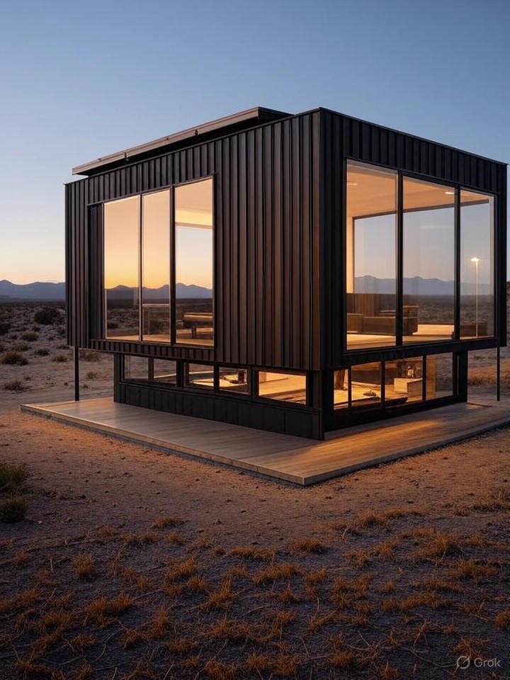
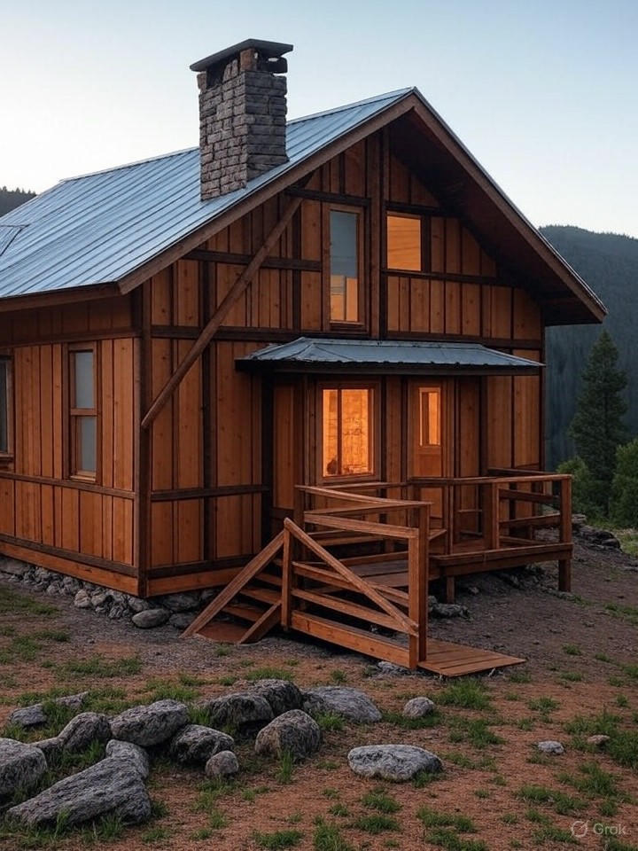
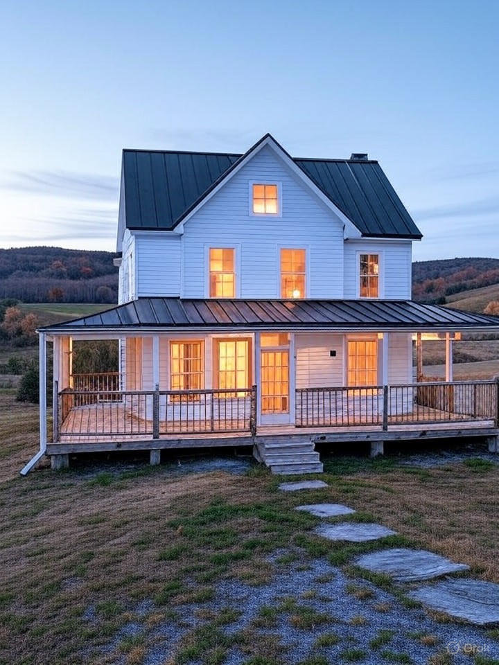

# What We Build Page - Offgrid Farmstays

## Hero Section

### Headline
**Every Property is Unique. Every Build is Custom.**

### Subheadline
From luxury mini-homes to glamping retreats to multi-unit properties—we design bitcoin-powered income generators tailored to your land, budget, and vision.

### Visual
[Split-screen collage: Left = Luxury mini-home, Center = Glamping tent/yurt, Right = Multi-unit A-frame cluster]

---

## Section 1: Our Three Core Property Types

### Intro Text
We specialize in three proven retreat formats, each engineered for maximum guest appeal, efficient construction, and strong revenue performance. All include integrated solar energy, bitcoin mining, and AirBTC booking setup.

**Not sure which is right for you?** We'll recommend the best fit during your free assessment based on your property, budget, and market.

---

## Section 2: Mini-Homes (Most Popular)

### Headline
**Luxury Mini-Homes: Premium Comfort, Compact Footprint**

### Visual

*Modern minimalist mini-home with integrated solar panels and mountain views*

### Overview

**What It Is**:
A fully-equipped small dwelling (300-600 sq ft) with full kitchen, bathroom, sleeping area, and climate control. Think luxury tiny home meets boutique hotel—designed for couples or small families seeking upscale off-grid escapes.

**Why Guests Love It**:
- Full amenities (not "roughing it")
- Modern design and high-end finishes
- Privacy and seclusion
- Eco-friendly appeal (solar-powered, off-grid)
- Unique experience (not a generic hotel)

**Why Landowners Love It**:
- Highest nightly rates ($150-$300/night typical)
- Year-round usability (full insulation, heating/cooling)
- Strong occupancy (appeals to broad guest demographics)
- Can use personally between bookings
- Highest resale value appreciation

---

### Specifications

**Typical Size**: 350-550 sq ft

**Structure**:
- Wood-frame or steel-frame construction
- SIPs (structural insulated panels) or traditional stick-built
- Metal or architectural shingle roofing
- Premium exterior siding (cedar, metal, board-and-batten)
- High R-value insulation (R-30 walls, R-50+ roof)

**Amenities**:
- Full kitchen (compact appliances, sink, cooktop, refrigerator)
- Full bathroom (shower, flush toilet, vanity)
- Sleeping area (queen or king bed, often lofted or Murphy-style)
- Living space (seating, dining, workspace)
- Climate control (geothermal or mini-split HVAC)
- Hot water (solar + heat reuse from mining)
- Outdoor deck or patio (100-200 sq ft additional)

**Energy Systems**:
- 12-18 kW solar array
- Geothermal or high-efficiency mini-split heating/cooling
- 4-6 immersion-cooled bitcoin miners
- Battery storage (optional, 10-20 kWh)
- Heat reuse: Domestic hot water + radiant floor heating

**Investment Range**: $65,000 - $120,000
- Budget: $65K-$80K (smaller, simpler finishes)
- Standard: $80K-$100K (most common)
- Premium: $100K-$120K (larger, luxury finishes, complex site)

**Revenue Potential**:
- Nightly Rate: $175-$275
- Occupancy: 60-75%
- Monthly Guest Revenue: $2,800-$4,500
- Monthly Bitcoin Revenue: $1,000-$1,800
- **Total Monthly: $3,800-$6,300**

---

### Featured Mini-Home Example: "The Ridgeline"

[Image gallery: 4-6 photos of actual project]

**Location**: Montana (25 acres, mountain views)
**Size**: 450 sq ft + 150 sq ft deck
**Investment**: $87,000
**Monthly Revenue**: $4,200 ($2,800 guests + $1,400 BTC)

**Standout Features**:
- Floor-to-ceiling windows (panoramic mountain views)
- Geothermal radiant floor heating
- Outdoor soaking tub (heated by mining heat)
- Custom live-edge wood countertops
- Solar powers everything including hot tub

**Owner's Feedback**:
*"I wanted something I could use myself a few weekends a year but mostly rent out. The quality is incredible—guests constantly comment on the attention to detail. It's booked solid May through October."*

[Button] See Full Case Study →

---

### Design Styles Available

We customize to your aesthetic and regional character:

**Modern Minimalist**

- Clean lines, metal and glass
- Flat or low-slope roof
- Scandinavian-inspired interiors

**Rustic Mountain**

- Timber frame or log accents
- Stone features, gable roof
- Cozy cabin aesthetic

**Contemporary Farmhouse**

- Board-and-batten siding
- Black metal roof, white trim
- Shiplap interiors, industrial fixtures

**Desert Modern**
- Stucco or metal siding
- Earth tones, integrated landscaping
- Indoor-outdoor flow

[Image grid: 4 examples of each style]

---

## Section 3: Glamping Retreats

### Headline
**Glamping Retreats: Luxury Camping, Zero Setup for Guests**

### Visual
[Hero image: Beautiful canvas tent or yurt in stunning natural setting, warm glow from interior, solar panels discreetly placed]

### Overview

**What It Is**:
Semi-permanent glamping structures—canvas tents, yurts, geodesic domes, or tiny cabins (200-400 sq ft)—that provide the outdoor experience with comfortable amenities. Lower construction cost than mini-homes, often faster permitting.

**Why Guests Love It**:
- Authentic "nature immersion" experience
- Instagram-worthy aesthetic
- Adventure + comfort balance
- Often allows pets (more booking flexibility)
- Unique stays that create memories

**Why Landowners Love It**:
- Lower upfront investment ($40K-$75K typical)
- Easier permitting (often classified as "temporary structures")
- Faster construction (4-6 weeks vs. 12-16 weeks)
- Seasonal operation option (lower maintenance in off-season)
- Easy to add multiple units (scale gradually)

---

### Specifications

**Typical Size**: 200-400 sq ft interior + outdoor living space

**Structure Types**:
- Safari-style canvas tents (wood platform + frame)
- Yurts (traditional or modern)
- Geodesic domes (transparent or opaque)
- Micro-cabins (simplified construction)

**Amenities**:
- Sleeping area (queen bed, luxury linens)
- Kitchenette or outdoor cooking area (varies by site)
- Private or shared bathhouse (composting toilet or septic)
- Heating (wood stove or propane, plus mining heat)
- Outdoor shower option (solar heated)
- Deck or patio space
- Fire pit and seating area

**Energy Systems**:
- 8-15 kW solar array (can serve multiple units)
- 2-4 bitcoin miners per unit (air or immersion cooled)
- Battery backup (especially if no grid connection)
- Heat reuse: Hot water for showers, space heating

**Investment Range**: $40,000 - $75,000
- Entry: $40K-$50K (basic tent platform, shared bath)
- Standard: $50K-$65K (yurt or dome, private bath)
- Premium: $65K-$75K (luxury finishes, complex site)

**Revenue Potential**:
- Nightly Rate: $125-$225
- Occupancy: 55-70% (often seasonal)
- Monthly Guest Revenue: $1,800-$3,500
- Monthly Bitcoin Revenue: $600-$1,200
- **Total Monthly: $2,400-$4,700**

---

### Featured Glamping Example: "The Maple Grove Duo"

[Image gallery: 4-6 photos]

**Location**: Vermont (40 acres, maple forest)
**Type**: 2 safari tents (400 sq ft each)
**Investment**: $112,000 (both units + shared solar)
**Monthly Revenue**: $5,250 ($4,250 guests + $1,000 BTC)

**Standout Features**:
- Vintage woodstove in each tent (cozy ambiance)
- Shared timber-frame bathhouse (composting toilets, hot showers)
- Mining heat pre-warms maple sap in spring (farm integration!)
- Glamping meets agritourism (guests buy maple syrup)

**Owner's Feedback**:
*"We only used this land for 2 months a year during maple season. Now it generates income year-round, and guests love the authentic farm experience. The glamping aesthetic attracts a crowd we never expected."*

[Button] See Full Case Study →

---

### Glamping Structure Options

**Canvas Safari Tents**
- Classic glamping aesthetic
- 4-season canvas (insulated)
- Wood platform and frame
- Most affordable option
- Best for: Forested settings, seasonal use

**Modern Yurts**
- Circular design, distinctive look
- Excellent insulation (year-round)
- Surprising interior space
- Durable and weather-resistant
- Best for: Open meadows, mountain views

**Geodesic Domes**
- Futuristic, highly Instagrammable
- Transparent panels option (stargazing!)
- Efficient heating (shape = less surface area)
- Strong wind resistance
- Best for: Dramatic landscapes, unique positioning

**Micro-Cabins**
- Small wood structures (150-300 sq ft)
- Easier permitting than full buildings
- Can be moved (sometimes)
- Traditional aesthetic
- Best for: Conservative zoning, traditional markets

[Image grid: Example of each type]

---

## Section 4: Multi-Unit Properties

### Headline
**Multi-Unit Properties: Scale Your Income, Build a Destination**

### Visual
[Hero image: 3-5 units clustered beautifully across property, shared amenities visible, solar arrays]

### Overview

**What It Is**:
Multiple mini-homes or glamping units on one property (3-10 units), creating a micro-resort experience. Shared energy systems and infrastructure reduce per-unit costs. Highest total revenue potential.

**Why Guests Love It**:
- Group travel option (families, retreats, weddings)
- Sense of place (destination vs. single cabin)
- Shared amenities (fire pits, trails, communal spaces)
- Often more activities and curated experiences

**Why Landowners Love It**:
- Revenue scales faster (multiple bookings)
- Risk diversification (one vacancy doesn't kill cash flow)
- Economies of scale (shared solar, septic, access road)
- Can hire manager (passive-passive income)
- Build phased (test market before full buildout)
- Highest total property value appreciation

---

### Specifications

**Typical Configuration**: 3-8 units on 10-40 acres

**Unit Types**:
- Matching mini-homes (cohesive design)
- Mix of glamping + mini-home (tiered pricing)
- Cluster of unique styles (variety for repeat guests)

**Shared Infrastructure**:
- Central solar array (20-40 kW)
- Shared access road and parking
- Common septic or individual systems
- Shared bitcoin mining facility (heat for communal hot tub/pool)
- Trails, fire pits, outdoor gathering spaces
- Optional: Shared bathhouse, kitchen, event space

**Energy Systems**:
- 25-50 kW solar array (scalable)
- 8-16 bitcoin miners (centralized or distributed)
- Large-scale heat reuse (pool, hot tubs, greenhouse)
- Battery storage (15-30 kWh)

**Investment Range**: $150,000 - $500,000+
- 3-Unit Property: $150K-$250K
- 5-Unit Property: $250K-$400K
- 8+ Unit Property: $400K-$600K+
(Phased construction reduces upfront capital needs)

**Revenue Potential**:
- Total Monthly Guest Revenue: $8,000-$25,000
- Monthly Bitcoin Revenue: $2,000-$5,000
- **Total Monthly: $10,000-$30,000**
- (Varies widely by unit count, size, location)

---

### Featured Multi-Unit Example: "The Coast Trio"

[Image gallery: Multiple photos showing all three cabins, interiors, amenities]

**Location**: Oregon Coast (5 acres, ocean views)
**Type**: 3 A-frame cabins (320 sq ft each)
**Built**: Phased 2022-2024
**Total Investment**: $165,000
**Monthly Revenue**: $7,400 ($6,800 guests + $600 BTC)

**Standout Features**:
- Staggered construction (validated market first)
- Shared 20 kW solar array
- Individual battery backup per cabin
- Communal fire pit with ocean views
- 4.9-star rating, 78% occupancy

**Owner's Feedback**:
*"I built one cabin in 2022 to test the market. It booked at 80% immediately. That gave me confidence to invest in cabins 2 and 3. Now I have a thriving micro-resort that basically runs itself. I hired a local cleaner and manager—I just collect checks and handle maintenance once a quarter."*

[Button] See Full Case Study →

---

### Multi-Unit Strategies

**Phased Growth** (Recommended)
- Build 1-2 units first
- Validate market demand and occupancy
- Reinvest earnings into units 3-5
- De-risks investment, proves concept

**All-In Launch**
- Build 3-5 units simultaneously
- Economies of scale (shared infrastructure)
- Immediate market presence
- Higher upfront capital, higher risk

**Mixed Use**
- 1-2 units for premium guests (luxury mini-homes)
- 3-4 units for budget-conscious (glamping)
- Captures multiple market segments
- Smooths seasonality

---

## Section 5: Comparison Table

### Headline
**Which Property Type is Right for You?**

### Table: Mini-Home vs. Glamping vs. Multi-Unit

| Factor | Mini-Home | Glamping | Multi-Unit |
|--------|-----------|----------|------------|
| **Investment** | $65K-$120K | $40K-$75K | $150K-$500K+ |
| **Construction Time** | 12-16 weeks | 4-8 weeks | 20-40 weeks (phased) |
| **Nightly Rate** | $175-$275 | $125-$225 | Varies by unit |
| **Occupancy** | 60-75% | 55-70% | 65-80% (aggregate) |
| **Monthly Revenue (Guest)** | $2,800-$4,500 | $1,800-$3,500 | $8,000-$25,000 |
| **Monthly Revenue (BTC)** | $1,000-$1,800 | $600-$1,200 | $2,000-$5,000 |
| **Permitting** | Moderate (ADU rules) | Easier (temp structure) | Complex (multi-dwelling) |
| **Year-Round?** | Yes (insulated) | Optional (4-season or seasonal) | Yes |
| **Personal Use** | Easy (1 unit) | Easy (1 unit) | Requires planning |
| **Resale Value** | Highest per sq ft | Moderate | Highest total |
| **Management** | Owner-operated | Owner-operated | Consider manager |
| **Best For** | Premium market, year-round, owner use | Lower budget, seasonal, unique experience | Scaling income, building destination |

---

## Section 6: Customization & Add-Ons

### Headline
**Make It Yours: Custom Features & Upgrades**

### Add-On Options (Grid layout)

**Hot Tubs & Spas**
💦
Heated by bitcoin mining heat reuse. Guests pay premium for hot tub access. $8K-$15K.

**Outdoor Kitchens**
🍳
Pizza oven, grill, sink, seating. Extends living space, increases bookings. $5K-$12K.

**Fire Pits & Gathering Spaces**
🔥
Custom stone or metal fire pits with seating. Essential for glamping aesthetic. $2K-$6K.

**Saunas**
🧖
Barrel or Finnish-style saunas heated by mining heat. Luxury amenity. $6K-$15K.

**Stargazing Decks**
✨
Elevated platforms with lounge seating, away from light pollution. $3K-$8K.

**Greenhouses**
🌱
Heated by mining, allows guest herb-picking or farm-to-table experiences. $4K-$10K.

**Pet Amenities**
🐕
Fenced areas, dog showers, pet beds. Expands your bookable market. $1K-$4K.

**EV Charging**
🔌
Solar-powered Level 2 EV chargers. Attracts Tesla-driving guests. $2K-$4K.

**Adventure Gear**
🚴
Mountain bikes, kayaks, snowshoes (if applicable). Creates experiences. $2K-$6K.

**Smart Home Tech**
📱
Keyless entry, remote climate control, security cameras. Ease of management. $1K-$3K.

---

## Section 7: The Design Process

### Headline
**How We Design Your Custom Retreat**

### 5-Step Process

**Step 1: Site Analysis**
We visit your property and assess:
- Solar exposure (critical for energy production)
- Topography and drainage
- Views and natural features
- Access and utilities
- Zoning and setback requirements

**Step 2: Conceptual Design**
Based on site + your goals, we sketch 2-3 layout options:
- Unit placement on property
- Architectural style recommendations
- Preliminary floor plans
- Energy system sizing

**Step 3: 3D Renderings**
You see photorealistic visualizations before committing:
- Exterior views from multiple angles
- Interior layouts with finishes
- Site plan showing solar, parking, landscaping

**Step 4: Engineering**
Master engineers design all systems:
- Structural calculations
- Solar and electrical systems
- Geothermal or HVAC sizing
- Bitcoin mining integration
- Heat reuse design

**Step 5: Final Approval**
You review complete plans and itemized budget:
- Every material specified
- Every cost detailed
- Timeline with milestones
- You sign off—construction begins

**Timeline**: 3-6 weeks from assessment to final proposal

---

## Section 8: Real Project Gallery

### Headline
**See What's Possible**

### Image Gallery Grid (12-20 images)

[Organized by category: Exteriors, Interiors, Energy Systems, Outdoor Spaces, Details]

- Montana mini-home at sunset
- Vermont glamping tent in fall foliage
- Oregon A-frame cluster
- Interior: Cozy living space with wood stove
- Interior: Modern kitchen with views
- Solar array on hillside
- Immersion cooling tanks
- Hot tub with mountain backdrop
- Fire pit gathering area
- Geodesic dome under stars
- Outdoor shower
- Custom deck with panoramic windows

[Button] View Full Project Portfolio →

---

## Section 9: Location Considerations

### Headline
**Where We Build (And What Works Best)**

### Regional Insights

**Mountain West** (MT, WY, CO, ID)
Best for: Mini-homes (winter appeal)
Solar: Excellent (high altitude, clear skies)
Market: Strong year-round tourism
Permitting: Moderate (rural counties vary)

**Pacific Northwest** (OR, WA)
Best for: Glamping (forest aesthetic)
Solar: Good (despite reputation—sufficient production)
Market: Strong spring-fall, softer winter
Permitting: Moderate to challenging (environmental regs)

**Southwest** (NM, AZ, NV, UT)
Best for: Mini-homes + glamping
Solar: Excellent (highest production)
Market: Growing (remote work migration)
Permitting: Easier (rural areas accommodating)

**Northeast** (VT, NH, ME)
Best for: Glamping + mini-homes
Solar: Good (4-season design critical)
Market: Strong seasonal (fall foliage, winter sports)
Permitting: Challenging (strict zoning)

**Texas**
Best for: All types
Solar: Excellent (abundant sun)
Market: Huge (diverse demographics)
Permitting: Easier (landowner-friendly culture)

[Button] See Projects by State →

---

## Section 10: Financing & Budget

### Headline
**Making It Affordable**

### Financing Options

**Cash Purchase** (Simplest)
- Fastest path to completion
- No interest costs
- Full equity immediately
- Best ROI timeline

**Home Equity Line of Credit (HELOC)**
- Borrow against existing property
- Low interest rates (variable)
- Pay as you go during construction
- Flexible repayment

**Construction Loan** (For larger projects)
- Bank finances build in draws
- Converts to mortgage after completion
- 20-25% down typical
- Best for multi-unit properties

**Partnership/Revenue Share** (Limited availability)
- We invest capital in exchange for revenue %
- Landowner contributes land + lower upfront cost
- Revenue split until we're repaid + return
- Then ownership transfers to landowner
- (Case-by-case basis, select projects only)

**Seller Financing** (If purchasing land + building)
- Land seller finances land purchase
- You finance construction separately
- Lower down payment overall
- Flexible terms

---

### Budget Planning

**What's Included in Our Quotes**:
✅ All design and engineering
✅ Permitting and applications
✅ Site preparation and foundation
✅ Complete structure and finishes
✅ Solar system and installation
✅ Geothermal or HVAC system
✅ Bitcoin mining equipment and setup
✅ Electrical, plumbing, septic
✅ AirBTC listing setup and training
✅ Project management and supervision

**What's NOT Included** (Client responsibility):
❌ Land purchase (if applicable)
❌ Access road beyond 100 ft from structure
❌ Well drilling (if needed—we coordinate, you pay)
❌ Utility connection fees (if grid-tied)
❌ Furnishings and decor (we can recommend vendors)
❌ Landscaping beyond basic grading
❌ Ongoing insurance and taxes

[Button] Get Custom Budget Estimate →

---

## Section 11: Next Steps

### Headline
**Ready to Build Your Income-Generating Retreat?**

### 3-Step Path

**Step 1: Free Assessment**
Schedule a no-cost, no-obligation consultation. We'll review your property, discuss your vision, and give honest feedback on feasibility.

[Button] Schedule Assessment →

---

**Step 2: Custom Proposal**
If it's a fit, we deliver a complete proposal with 3D renderings, floor plans, energy system design, itemized budget, and revenue projections.

**Timeline**: 3-6 weeks
**Cost**: $0 until you sign contract

---

**Step 3: Build & Launch**
Sign contract, we handle everything, you watch your property transform. In 6-8 months, you welcome your first guests and start earning.

---

## Section 12: FAQ for This Page

**Q: Can I choose a different style than your examples?**
Yes. We customize every design to your aesthetic preferences, regional character, and site constraints. Bring inspiration photos—we'll make it work.

**Q: Can you build on my existing foundation/structure?**
Sometimes. We assess existing structures for code compliance and integration feasibility. Adaptive reuse can save costs if the bones are good.

**Q: What if I want to live there full-time, not rent it?**
We can build primary residences with the same systems. The economics change (no rental income), but the energy benefits remain. Many clients do hybrid: live there 3-6 months, rent 6-9 months.

**Q: Can I add units later?**
Yes. We design energy systems with expansion in mind. Many clients build 1-2 units, validate the market, then add more. Phased growth is smart.

**Q: Do you build outside your current states?**
We're expanding. If your state isn't listed, contact us—we evaluate new markets based on demand and regulatory environment.

[Button] See All FAQs →

---

## Footer
[Standard footer]

---

## Page Metadata (SEO)

**Title Tag**:
What We Build - Bitcoin-Powered Mini-Homes & Glamping Retreats

**Meta Description**:
Custom off-grid mini-homes ($65K-$120K), glamping retreats ($40K-$75K), and multi-unit properties. Solar + bitcoin mining + AirBTC integration. See options.

**Keywords**:
off-grid mini home builders, glamping retreat construction, bitcoin mining cabin, solar powered tiny house, ADU construction, multi-unit glamping property

**Schema Markup**:
- Service
- Product (for each property type)
- Offer
