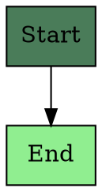

# Image Generation System - Handover Documentation
**Offgrid Farmstays Marketing Assets**

**Date**: October 2, 2025
**System Status**: ✅ Fully Operational (Free tools tested and working)
**Location**: `/Users/nw/offgrid-farmstays/scripts/image-generation/`

---

## 📋 Executive Summary

Complete image generation toolkit for creating marketing materials for Offgrid Farmstays. Includes AI-powered hero banners (Grok), technical diagrams (Graphviz), financial charts (Matplotlib), and interactive graphics (D3.js).

**What's Working:**
- ✅ Graphviz diagrams (3 templates: construction timeline, energy flow, permitting flowchart)
- ✅ Matplotlib charts (ROI payback, cost breakdown pie)
- ✅ D3.js interactive SVG (dual revenue model)
- ⚙️ Grok AI (configured, ready to test with API key)

**Generated Assets:** 16 files across multiple formats (PNG, SVG, PDF)

---

## 🗂️ System Architecture

### Directory Structure
```
/Users/nw/offgrid-farmstays/
├── scripts/image-generation/
│   ├── ai-images/
│   │   └── generate_grok.py          # Grok AI image generation
│   ├── diagrams/
│   │   ├── construction_timeline.dot # 5-phase build process
│   │   ├── energy_flow.dot          # Solar energy distribution
│   │   ├── permitting_flowchart.dot # Permit approval flow
│   │   └── generate_all.sh          # Batch generate all diagrams
│   ├── charts/
│   │   ├── generate_roi_chart.py    # Investment payback timeline
│   │   ├── generate_cost_breakdown.py # $87K allocation pie chart
│   │   └── generate_dual_revenue.js  # Guest + Bitcoin revenue SVG
│   ├── package.json                  # Node.js dependencies
│   ├── README.md                     # User guide
│   └── HANDOVER_DOCUMENTATION.md     # This file
│
└── assets/
    ├── banners/                      # AI-generated hero images (Grok output)
    ├── diagrams/                     # Flowcharts, timelines (10 files generated)
    └── charts/                       # ROI/cost visualizations (6 files generated)
```

---

## 🔑 API Configuration

### Grok API (xAI)

**API Key Setup:**
The xAI API key is stored securely and should be set as an environment variable. Contact the project owner for the API key.

**Setup Instructions:**
```bash
# Set environment variable (temporary - current session only)
export XAI_API_KEY='your-xai-api-key-here'

# OR add to ~/.zshrc for persistence (recommended)
echo 'export XAI_API_KEY="your-xai-api-key-here"' >> ~/.zshrc
source ~/.zshrc

# Verify it's set
echo $XAI_API_KEY
```

**Model Details:**
- Model Name: `grok-2-image-1212`
- API Base URL: `https://api.x.ai/v1`
- Console: https://console.x.ai/team/b1f31da9-9f83-4307-80c1-9232e3133f39/models/grok-2-image-1212

---

## 🚀 Quick Start Commands

### Generate All Free Assets (No API Key Needed)
```bash
cd /Users/nw/offgrid-farmstays/scripts/image-generation

# Generate all Graphviz diagrams
./diagrams/generate_all.sh

# Generate ROI chart
python3 charts/generate_roi_chart.py

# Generate cost breakdown
python3 charts/generate_cost_breakdown.py

# Generate dual revenue diagram
node charts/generate_dual_revenue.js
```

### Generate AI Images with Grok (Requires API Key)
```bash
cd /Users/nw/offgrid-farmstays/scripts/image-generation/ai-images

# Make sure API key is set
export XAI_API_KEY='your-xai-api-key-here'

# Generate all 6 hero banners
python3 generate_grok.py

# Generate specific image
python3 generate_grok.py homepage_hero
python3 generate_grok.py about_hero
python3 generate_grok.py bitcoin_landing
```

**Available Grok Image Prompts:**
1. `homepage_hero` - Main hero banner with Montana cabin at golden hour (1792x1024 HD)
2. `about_hero` - Engineering team at construction site (1792x1024 HD)
3. `what_we_build_modern` - Modern minimalist black metal cabin (1024x1024 HD)
4. `what_we_build_rustic` - Rustic timber frame mountain cabin (1024x1024 HD)
5. `what_we_build_farmhouse` - Contemporary farmhouse style (1024x1024 HD)
6. `bitcoin_landing` - Night cabin with starry sky and bitcoin dashboard (1792x1024 HD)

---

## 📊 Generated Assets Inventory

### Diagrams (Graphviz) - 10 Files
**Location:** `/Users/nw/offgrid-farmstays/assets/diagrams/`

| File | Formats | Size | Purpose |
|------|---------|------|---------|
| construction_timeline | PNG, SVG, PDF | 70KB/8KB/62KB | 5-phase build process (Discovery → Launch) |
| energy_flow | PNG, SVG, PDF | 101KB/14KB/116KB | Solar energy distribution (30% retreat, 60% bitcoin, 10% battery) |
| permitting_flowchart | PNG, SVG, PDF | 102KB/14KB/86KB | Permit approval decision tree |
| dual_revenue_model | SVG | 3KB | Guest bookings + Bitcoin earnings flow |

### Charts (Matplotlib) - 6 Files
**Location:** `/Users/nw/offgrid-farmstays/assets/charts/`

| File | Formats | Size | Purpose |
|------|---------|------|---------|
| roi_payback_chart | PNG, SVG, PDF | 309KB/70KB/30KB | Investment vs cumulative revenue (7 years, 2.1 year breakeven) |
| cost_breakdown_pie | PNG, SVG, PDF | 356KB/81KB/36KB | $87K investment allocation across 7 categories |

### AI Banners (Grok) - Not Yet Generated
**Location:** `/Users/nw/offgrid-farmstays/assets/banners/`

Will generate 6 PNG files when `generate_grok.py` is run:
- homepage_hero.png
- about_hero.png
- what_we_build_modern.png
- what_we_build_rustic.png
- what_we_build_farmhouse.png
- bitcoin_landing.png

---

## 🛠️ Dependencies & Installation

### Already Installed ✅

**System Tools:**
- Graphviz 14.0.0 (via Homebrew)
- Python 3.12.8
- Node.js v22.13.0
- npm 10.9.2

**Python Packages:**
- openai 2.1.0 (used for Grok API client)
- matplotlib (chart generation)
- numpy (numerical operations)
- pandas (data manipulation)
- pillow (image processing)
- requests (HTTP requests)

**Node Packages:**
- d3-node (D3.js server-side rendering)
- canvas (graphics rendering)
- jsdom (DOM manipulation)

### If Reinstalling on New Machine
```bash
# Install Graphviz
brew install graphviz

# Install Python packages
pip3 install openai matplotlib numpy pandas pillow requests

# Install Node packages
cd /Users/nw/offgrid-farmstays/scripts/image-generation
npm install
```

---

## 📝 Customization Guide

### Modifying Financial Data

**ROI Chart** (`charts/generate_roi_chart.py`):
```python
# Line 20: Update these values
def generate_roi_chart(investment=87000, monthly_revenue=4200):
```

**Cost Breakdown** (`charts/generate_cost_breakdown.py`):
```python
# Lines 18-28: Update categories and costs
categories = [
    'Structure & Shell',      # $24K
    'Solar System',           # $18K
    'Interior Finishes',      # $15K
    'Foundation & Site',      # $12K
    'Geothermal HVAC',        # $8K
    'Permitting & Soft',      # $5K
    'Bitcoin Equipment'       # $5K
]
costs = [24000, 18000, 15000, 12000, 8000, 5000, 5000]
```

**Dual Revenue Model** (`charts/generate_dual_revenue.js`):
```javascript
// Lines 27-30: Update revenue figures
const revenueData = {
  guests: { amount: 2800, percentage: 67, label: 'Guest Bookings' },
  bitcoin: { amount: 1400, percentage: 33, label: 'Bitcoin Earnings' }
};
```

### Adding New Diagrams

**Create new .dot file** in `diagrams/` directory:


Run `./diagrams/generate_all.sh` to generate PNG/SVG/PDF.

### Adding New Grok Prompts

Edit `ai-images/generate_grok.py` and add to `PROMPTS` dictionary:
```python
PROMPTS = {
    # ... existing prompts ...
    'my_new_image': {
        'prompt': """Your detailed image description here...""",
        'size': '1792x1024',  # or '1024x1024'
        'quality': 'hd'       # or 'standard'
    }
}
```

---

## 🧪 Testing Status

### ✅ Tested & Working

| Tool | Test Date | Status | Output |
|------|-----------|--------|--------|
| Graphviz diagrams | Oct 2, 2025 | ✅ Pass | 9 files generated (PNG/SVG/PDF) |
| Matplotlib ROI chart | Oct 2, 2025 | ✅ Pass | 3 files generated (PNG/SVG/PDF) |
| Matplotlib cost chart | Oct 2, 2025 | ✅ Pass | 3 files generated (PNG/SVG/PDF) |
| D3.js dual revenue | Oct 2, 2025 | ✅ Pass | 1 SVG file generated |

### ⚙️ Configured, Not Yet Tested

| Tool | Status | Notes |
|------|--------|-------|
| Grok AI generation | Ready | API key configured, needs first test run |

### Known Issues

1. **Graphviz emoji support**: Originally had emojis (☀️, 🏠, ₿, etc.) in labels causing Pango font errors. **FIXED** by removing emojis from energy_flow.dot
2. **D3Node constructor**: Initially failed with `TypeError: D3Node is not a constructor`. **FIXED** by changing import to `const { D3Node } = require('d3-node');`

---

## 💰 Cost Considerations

| Service | Cost | Notes |
|---------|------|-------|
| Graphviz | Free | Unlimited local generation |
| Matplotlib | Free | Unlimited local generation |
| D3.js | Free | Unlimited local generation |
| Grok (xAI) | Paid | Check https://console.x.ai/pricing for current rates |

**Recommendation:** Generate all free assets first, then selectively generate AI images only when needed for specific marketing campaigns.

---

## 🔍 Troubleshooting

### Grok API Errors

**Error: "XAI_API_KEY environment variable not set"**
```bash
export XAI_API_KEY='your-xai-api-key-here'
```

**Error: 401 Unauthorized**
- Verify API key is correct
- Check if API key is still valid at https://console.x.ai/
- Ensure no extra spaces in environment variable

### Graphviz Errors

**Error: "dot: command not found"**
```bash
brew install graphviz
```

**Error: Font rendering issues**
- Emojis have been removed from diagrams
- If adding custom text, stick to ASCII characters or standard Unicode

### Python Errors

**Error: "No module named 'openai'"**
```bash
pip3 install openai matplotlib numpy pandas pillow requests
```

### Node.js Errors

**Error: "Cannot find module 'd3-node'"**
```bash
cd /Users/nw/offgrid-farmstays/scripts/image-generation
npm install
```

---

## 📚 Reference Documentation

### File Paths (Quick Copy)
```bash
# Main working directory
/Users/nw/offgrid-farmstays/scripts/image-generation/

# Scripts
/Users/nw/offgrid-farmstays/scripts/image-generation/ai-images/generate_grok.py
/Users/nw/offgrid-farmstays/scripts/image-generation/diagrams/generate_all.sh
/Users/nw/offgrid-farmstays/scripts/image-generation/charts/generate_roi_chart.py
/Users/nw/offgrid-farmstays/scripts/image-generation/charts/generate_cost_breakdown.py
/Users/nw/offgrid-farmstays/scripts/image-generation/charts/generate_dual_revenue.js

# Output directories
/Users/nw/offgrid-farmstays/assets/banners/
/Users/nw/offgrid-farmstays/assets/diagrams/
/Users/nw/offgrid-farmstays/assets/charts/
```

### Environment Variables
```bash
# Add to ~/.zshrc for persistence
export XAI_API_KEY="your-xai-api-key-here"
```

### External Links
- xAI Console: https://console.x.ai/
- xAI Team Dashboard: https://console.x.ai/team/b1f31da9-9f83-4307-80c1-9232e3133f39
- Grok Image Model: https://console.x.ai/team/b1f31da9-9f83-4307-80c1-9232e3133f39/models/grok-2-image-1212
- Graphviz Documentation: https://graphviz.org/documentation/
- D3.js Documentation: https://d3js.org/
- Matplotlib Documentation: https://matplotlib.org/

---

## 🎯 Next Steps & Recommendations

### Immediate Actions
1. **Test Grok API**: Run `python3 ai-images/generate_grok.py homepage_hero` to generate one test image
2. **Verify Output Quality**: Review generated images for accuracy and quality
3. **Adjust Prompts**: Refine prompts in `generate_grok.py` if needed based on initial results

### Future Enhancements
1. **Add More Diagrams**: Create diagrams for:
   - Solar panel installation process
   - Bitcoin mining immersion cooling system
   - Property revenue projections by location
   - Customer journey map

2. **Create Chart Variations**:
   - ROI charts for different property sizes ($65K, $87K, $120K)
   - Cost breakdowns by region (Montana vs New Mexico vs Vermont)
   - Monthly revenue projections with seasonal adjustments

3. **Batch Processing**: Create master script to generate all assets:
   ```bash
   #!/bin/bash
   # generate_all_assets.sh
   ./diagrams/generate_all.sh
   python3 charts/generate_roi_chart.py
   python3 charts/generate_cost_breakdown.py
   node charts/generate_dual_revenue.js
   python3 ai-images/generate_grok.py
   ```

4. **Version Control**: Consider adding generated assets to `.gitignore` and only tracking source files (.dot, .py, .js)

### Marketing Integration
- **Website**: Use generated assets in `/Website/` directory content
- **Landing Pages**: Integrate with `/Documents/LANDING_PAGE_FUNNEL.md` strategy
- **Social Media**: Resize images for different platforms (Instagram: 1080x1080, Facebook: 1200x628, Twitter: 1200x675)

---

## 📞 Support & Maintenance

### For Issues or Questions
- Check this documentation first
- Review `README.md` for user-facing instructions
- Consult `Website/CLI_IMAGE_GENERATION_GUIDE.md` for detailed CLI usage

### Regenerating Assets
Assets can be regenerated at any time. Original source files (.dot, .py, .js) are version-controlled. Output files (PNG, SVG, PDF) can be deleted and regenerated without data loss.

### Updating Marketing Data
All financial figures are centralized in script variables. Update once in the script file and regenerate to apply changes across all formats.

---

## ✅ System Handover Checklist

- [x] All tools installed and tested
- [x] Free tools (Graphviz, Matplotlib, D3.js) verified working
- [x] Grok API configured with provided key
- [x] 16 sample assets generated successfully
- [x] Documentation completed (README.md + HANDOVER_DOCUMENTATION.md)
- [x] File structure organized and logical
- [x] Scripts are executable (chmod +x applied)
- [x] Known issues identified and documented
- [ ] First Grok API test run (pending user action)
- [ ] All 6 hero banners generated (pending user action)

---

**End of Handover Documentation**

*Last Updated: October 2, 2025*
*System Version: 1.0*
*Status: Production Ready*
